# Week08 Shadow Rendering Engine Description

## 1. 문서 목적

이 문서는 Week08 발제의 Shadow Map 요구사항을 현재 엔진 구현 기준으로 설명하기 위한 문서이다.

발표자료의 흐름은 다음 순서를 따른다.

1. Shadow Map 기본 원리
2. Local Light Shadow
3. Shadow Atlas
4. Directional Light Shadow
5. Shadow Artifact와 Bias
6. Anti-aliasing Filter
7. Shadow Sharpen

현재 엔진 구현도 동일하게 크게 두 축으로 나뉜다.

- Directional Light Shadow: PSM / CSM, 전용 Directional Shadow Array 사용
- Local Light Shadow: Point / Spot, 단일 Local Shadow Atlas 사용

---

## 2. 발제 요구사항 대응 요약

| 발제 항목 | 현재 구현 상태 | 주요 코드 |
| --- | --- | --- |
| `bCastShadows`가 켜진 Light만 Shadow 렌더링 | 구현됨 | `FLightShadowSettings::bCastShadows`, `FShadowRenderer::Render*Shadow` |
| Directional / Point / Spot 동시 대응 | 구현됨 | `FSceneEnvironment`, `FShadowRenderer::RenderShadows` |
| PSM 기반 Directional Shadow | 구현됨 | `BuildPSMViewProjection`, `PSMCommonShadowMap.hlsl` |
| CSM 기반 Directional Shadow | 구현됨 | `UpdateCascades`, `DirectionalShadowArray` |
| Point Light 6방향 Shadow | 구현됨 | `FPointShadowData::View[6]`, `PointLightComponent.cpp` |
| Spot Light 1개 Shadow View | 구현됨 | `FSpotShadowData::View`, `SpotLightComponent.cpp` |
| Unlit ViewMode에서 Shadow 처리 제외 | 구현됨 | `FShadowRuntimeOptions::bSkipShadowPassInUnlit` |
| Light Property에 Shadow Map 표시 | 구현됨 | `FEditorPropertyWidget::Render*ShadowPreview` |
| Light 시점 Override Camera | 구현됨 | `FEditorViewportClient::ApplyLightPerspectiveOverride` |
| Shadow Map 해상도 변경 | 구현됨 | `ShadowResolutionScale`, `FShadowResolutionPolicy` |
| PCF 구현 | 구현됨 | `SampleShadowAtlasPCFBox`, `SampleShadowAtlasPCFPoisson` |
| VSM / ESM | 구현됨 | `MomentShadowMap.hlsl`, `ShadowMomentBlur.hlsl` |
| Shadow Atlas | 구현됨 | `FShadowAtlasResource`, `FLocalShadowAtlasAllocator` |
| ShowFlag / Stat | 구현됨 | `shadow show`, `stat shadow`, `stat csm` |

---

## 3. 전체 Shadow 렌더링 흐름

Shadow 시스템은 `FRenderer -> FShadowRenderer -> FShadowResourceManager` 흐름으로 동작한다.

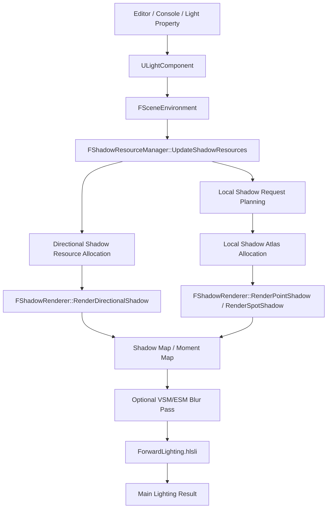

주요 실행 순서는 다음과 같다.

1. `FRenderer::Render`에서 Shadow Pass가 실행된다.
2. `FShadowResourceManager::UpdateShadowResources`가 필요한 Shadow 자원을 준비한다.
3. Local Light는 `FLocalShadowRequestPlanner`가 Shadow Request를 만든다.
4. `FLocalShadowAllocationExecutor`가 Local Shadow Atlas 안에 Tile을 배치한다.
5. `FShadowRenderer::RenderShadows`가 Directional, Point, Spot Shadow View를 렌더링한다.
6. VSM / ESM 모드에서는 Moment Map에 대해 Horizontal / Vertical Blur를 수행한다.
7. Main Pass의 Forward Lighting Shader에서 각 Light별 Shadow Visibility를 샘플링한다.

---

## 4. Light Component와 Shadow 설정

Shadow 관련 Editor Property는 `ULightComponent` 계열에 저장된다.

```cpp
class ULightComponent : public ULightComponentBase
{
protected:
    float ShadowResolutionScale = 1.f;
    float ShadowBias = 0.2f;
    float ShadowSlopeBias = 0.2f;
    float ShadowSharpen = 0.35f;
    bool bOverrideCameraWithLightPerspective = false;
};
```

`ULightComponentBase`에는 `bCastShadows`가 있고, 각 Light Component는 `PushToScene()`을 통해 Scene의 Light Params로 값을 전달한다.

| 설정 | 의미 | 사용 위치 |
| --- | --- | --- |
| `bCastShadows` | Shadow 렌더링 여부 | Shadow resource 생성 / Shadow pass 제출 |
| `ShadowResolutionScale` | 요청 Shadow 해상도 배율 | `FShadowResourceManager`, `FLocalShadowRequestPlanner` |
| `ShadowBias` | Constant Bias | `ForwardLighting.hlsli` |
| `ShadowSlopeBias` | Slope Bias | `ForwardLighting.hlsli` |
| `ShadowSharpen` | Shadow visibility 후처리 선명도 | `ApplyShadowSharpen` |
| `bOverrideCameraWithLightPerspective` | Light 시점 카메라 Override | `FEditorViewportClient` |

---

## 5. Shadow Data 구조

Shadow View의 공통 데이터는 `FShadowViewData`가 담당한다.

```cpp
struct FShadowViewData
{
    FShadowMapResource DepthMap;
    FMatrix LightView;
    FMatrix LightProj;
    FMatrix LightViewProj;

    uint32 AtlasOffsetX;
    uint32 AtlasOffsetY;
    uint32 AtlasSizeX;
    uint32 AtlasSizeY;
    uint32 AtlasIndex;
    bool bAtlasAllocated;
};
```

`FShadowViewData`는 이름상 `DepthMap`을 들고 있지만, 실제로는 PCF / VSM / ESM 경로를 모두 담는 공통 컨테이너다.

- PCF: Depth Texture, DSV, SRV 중심
- VSM / ESM: Moment Texture, RTV, SRV와 Depth Texture, DSV를 함께 사용

Light별 Shadow Data는 다음처럼 구성된다.

```cpp
struct FDirectionalShadowData
{
    FShadowViewData PSMView;
    FShadowViewData View[4]; // CSM cascade
};

struct FPointShadowData
{
    FShadowViewData View[6]; // cube face
};

struct FSpotShadowData
{
    FShadowViewData View;
};
```

---

## 6. Local Light Shadow

Local Light는 Spot Light와 Point Light를 의미한다.

### Spot Light

Spot Light는 하나의 Perspective Shadow View를 가진다.


Spot Light의 View / Projection은 `USpotLightComponent::PushToScene()`에서 구성되고, Shadow Pass에서는 해당 View를 Atlas의 한 영역에 렌더링한다.

### Point Light

Point Light는 Cube Map과 유사하게 6개의 방향을 가진다.

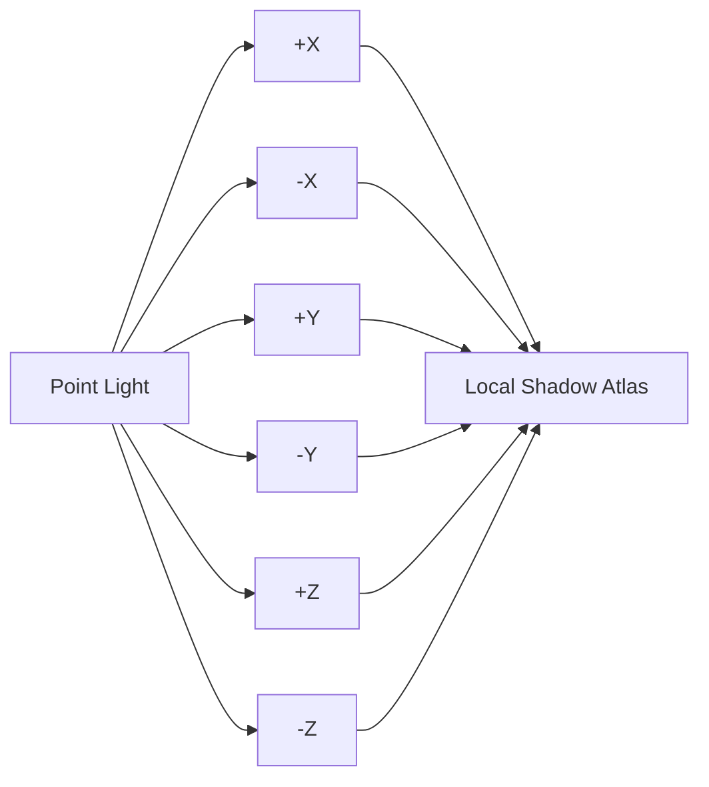

현재 구현은 Point Light마다 최대 6개의 `FShadowViewData`를 만들고, 각 Face를 독립적인 Shadow Request로 다룬다.

Point Face 중 Caster가 없는 경우는 `FLocalShadowAllocationExecutor::PruneInvalidOrEmptyPointFaceRequests`에서 제외될 수 있다. 이때 강제로 Light Perspective Override 중인 Face는 디버깅을 위해 우선 렌더링 대상으로 유지된다.

---

## 7. Shadow Atlas

Local Light Shadow는 개별 Shadow Texture를 많이 만드는 대신 하나의 큰 Atlas에 배치된다.

현재 기본 Local Atlas 해상도는 다음과 같다.

```cpp
constexpr uint32 GLocalShadowAtlasResolution = 4096;
```

Atlas를 사용하는 이유는 다음과 같다.

- Pixel Shader에 전달하는 Shadow SRV 수를 줄일 수 있다.
- Point / Spot Shadow Map을 하나의 Texture로 관리할 수 있다.
- Light 수가 많아져도 Shader Resource Binding 구조를 단순하게 유지할 수 있다.

### Local Shadow Atlas 자원 구조

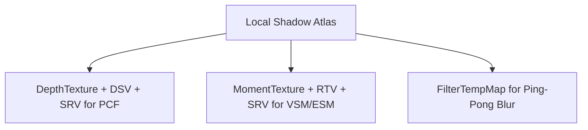

PCF일 때는 Depth Atlas를 DSV로 기록하고 SRV로 샘플링한다.

VSM / ESM일 때는 Moment Atlas를 RTV로 기록하고, 별도 Depth Texture를 DSV로 사용한다. 이후 `FilterTempMap`과 Ping-Pong 방식으로 Blur를 수행한다.

---

## 8. Local Shadow Atlas 할당 정책

발표자료의 Shadow Atlas 정책은 현재 코드에서 다음 클래스로 분리되어 있다.

| 역할 | 클래스 |
| --- | --- |
| Request 생성 | `FLocalShadowRequestPlanner` |
| Request 정렬 / 우선순위 | `FLocalShadowRequestPlanner::SortRequests` |
| Atlas 공간 할당 | `FLocalShadowAtlasAllocator` |
| Allocation 실행 / 적용 | `FLocalShadowAllocationExecutor` |

### Request 생성

Spot Light는 1개 Request를 만든다.

Point Light는 Face별로 6개 Request를 만든다.

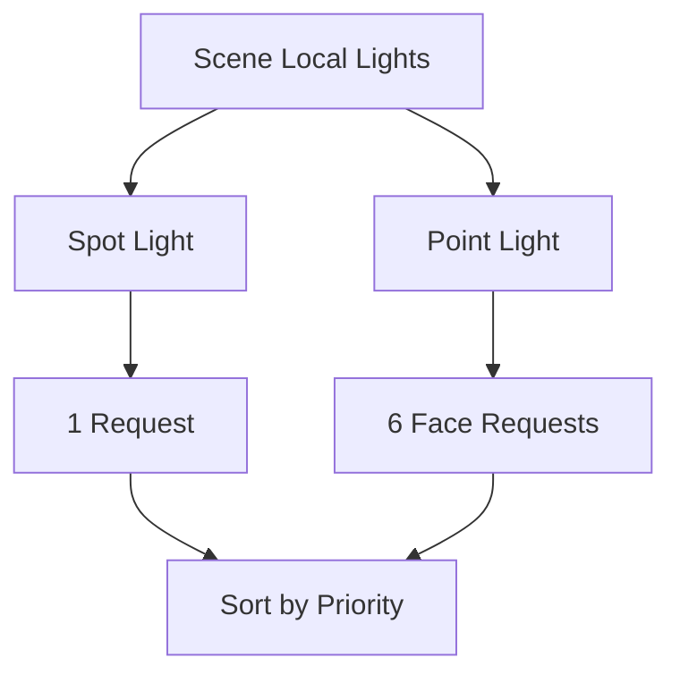

### Priority 계산

현재 Priority는 거리, 광량, Light Type을 사용한다.

```cpp
Priority =
    0.80 * CameraDistanceTerm +
    0.18 * IntensityTerm +
    0.02 * TypeBase;
```

의도는 다음과 같다.

- 카메라에 가까운 Light를 우선한다.
- 밝은 Light를 우선한다.
- Spot Light는 Point Face보다 약간 우선한다.
- Override Camera가 켜진 Light는 강제로 우선한다.

### Resolution 정책

Local Shadow 기본 정책은 다음과 같다.

```cpp
LocalResolutionPolicy.BaseResolution = 512;
LocalResolutionPolicy.MinResolution = 64;
LocalResolutionPolicy.MaxResolution = 1024;
LocalResolutionPolicy.Alignment = 64;
```

다만 계획 단계에서는 품질 안정성을 위해 256을 최소 계획 해상도로 사용한다.

```cpp
const uint32 PlanningMinResolution = ClampAndAlignResolution(256u, LocalResolutionPolicy);
```

즉 현재 구현은 두 단계로 동작한다.

1. Planning 단계: 가능한 많은 Light를 수용하기 위해 우선 256 기준으로 Admit한다.
2. Upgrade 단계: 남은 Atlas 면적을 Priority 순으로 더 높은 해상도에 배분한다.
3. 실제 Allocation 단계: 공간이 부족하면 64 Alignment 단위로 낮추며 fallback 배치를 시도한다.

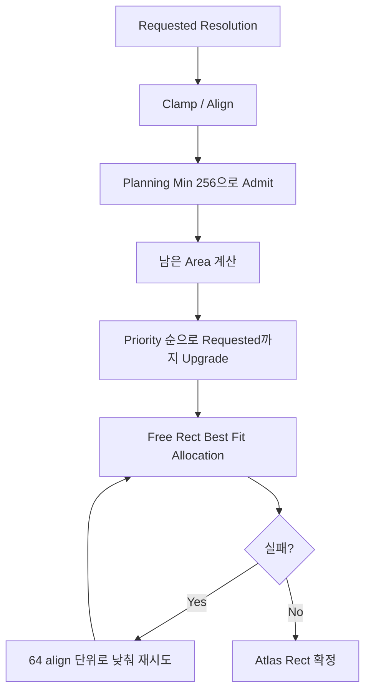

### Free Rect Allocator

`FLocalShadowAtlasAllocator`는 Atlas 전체를 하나의 Free Rect로 시작한다. Request가 들어오면 가장 낭비 면적이 적은 Rect를 고르고, 할당 후 남은 영역을 두 개의 Free Rect로 분할한다.

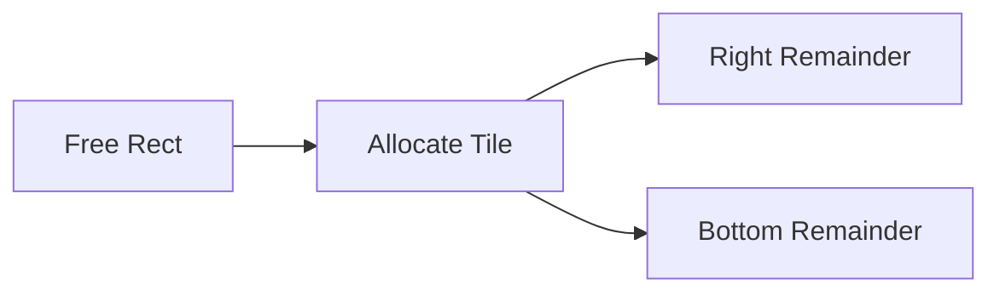

현재는 Eviction / Repack / Persistence 없이 매 프레임 Request를 다시 계산하고 Atlas를 재배치하는 단순 정책이다.

---

## 9. Directional Light Shadow

Directional Light는 위치가 없는 무한 광원이다. 따라서 Local Light처럼 일정한 구형/원뿔 범위를 기준으로 Shadow Map을 만들 수 없다.

현재 구현은 두 가지 방식을 제공한다.

- PSM: Perspective Shadow Map
- CSM: Cascaded Shadow Map

전역 옵션은 다음 enum으로 관리된다.

```cpp
enum class EDirectionalShadowMode : uint8
{
    PSM,
    CSM,
};
```

### Directional Shadow Array

Directional Light는 Local Atlas와 별도 자원을 사용한다.

```cpp
struct FDirectionalShadowArray
{
    ID3D11Texture2D* Texture;
    ID3D11DepthStencilView* DSVs[5];
    ID3D11ShaderResourceView* SRV;

    ID3D11Texture2D* MomentTexture;
    ID3D11RenderTargetView* MomentRTVs[5];
    ID3D11ShaderResourceView* MomentSRV;

    ID3D11Texture2D* MomentFilterTempTexture;
    ID3D11RenderTargetView* MomentFilterTempRTVs[5];
    ID3D11ShaderResourceView* MomentFilterTempSRV;
};
```

Slice 구성은 다음과 같다.

| Slice | 용도 |
| --- | --- |
| 0 | PSM |
| 1 | CSM Cascade 0 |
| 2 | CSM Cascade 1 |
| 3 | CSM Cascade 2 |
| 4 | CSM Cascade 3 |

PSM 모드에서는 Slice 0을 사용한다. CSM 모드에서는 Slice 1~4를 사용한다.

---

## 10. PSM

PSM은 카메라의 Perspective Projection 이후 공간에서 Light View를 구성하는 방식이다.

발표자료의 핵심 설명은 다음과 같다.

> 카메라의 View Frustum에 들어온 물체만 Shadow Map에 담는다.

현재 구현에서는 `BuildPSMViewProjection`이 PSM용 Matrix를 계산한다.

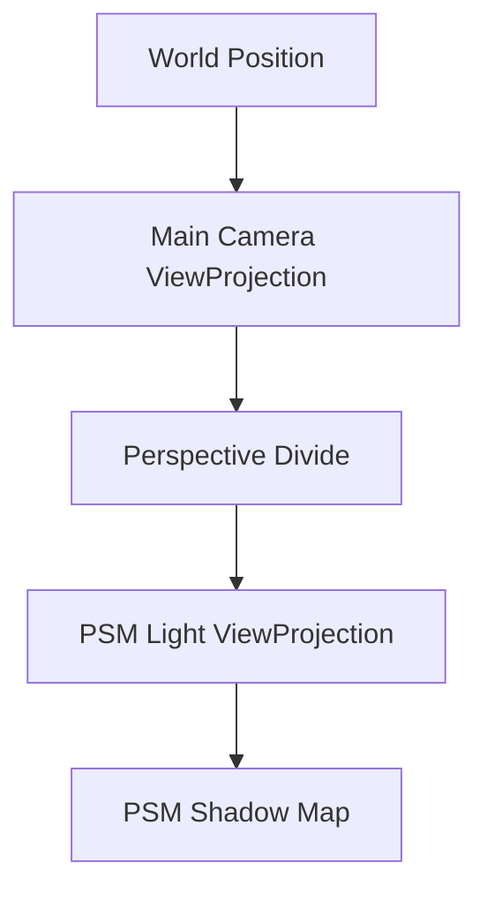

PSM용 Shader는 일반 Shadow Shader와 다르다.

| 목적 | Shader |
| --- | --- |
| PCF / None | `PSMCommonShadowMap.hlsl` |
| VSM / ESM | `PSMMomentShadowMap.hlsl` |

PSM Shadow Pass에서는 `FPSMShadowConstants`를 `b2`에 바인딩하여 Main Camera VP와 PSM Light VP를 함께 넘긴다.

```cpp
cbuffer PSMShadowBuffer : register(b2)
{
    float4x4 ShadowPSMMainViewProjection;
    float4x4 ShadowPSMLightViewProjection;
}
```

---

## 11. CSM

CSM은 카메라 Frustum을 거리별 Cascade로 나누고, 각 Cascade마다 별도 Ortho Shadow Map을 만든다.

발표자료 흐름은 현재 구현과 동일하다.

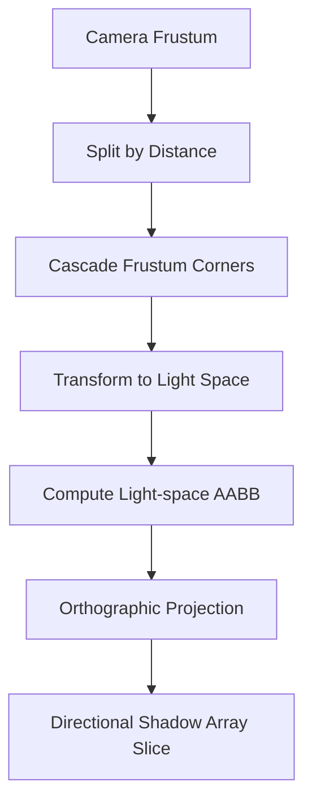

`UpdateCascades`는 다음 일을 수행한다.

1. Camera Near / Far를 기준으로 Cascade 구간을 계산한다.
2. 각 Cascade의 Frustum corner를 만든다.
3. Corner를 World Space로 변환한다.
4. 다시 Light Space로 변환한다.
5. Light Space AABB를 구한다.
6. AABB 범위로 Ortho Projection을 만든다.

Cascade 분할은 `FDirectionalShadowData::DistributeExponent`를 사용한다.

---

## 12. PCF

PCF는 Shadow Map의 이산적인 Binary 결과를 주변 샘플 평균으로 부드럽게 만드는 필터다.

현재 구현은 두 가지 PCF를 제공한다.

| 모드 | 설명 | Shader 함수 |
| --- | --- | --- |
| `PCF_BOX` | 3x3 Box PCF | `SampleShadowAtlasPCFBox` |
| `PCF_POISSON` | 16-sample Rotated Poisson Disk | `SampleShadowAtlasPCFPoisson` |

PCF는 별도의 Blur Pass를 사용하지 않는다. Shadow Sampling 시점에서 주변 texel을 직접 샘플링한다.


Atlas 기반 Local Shadow에서는 Tile 밖을 읽지 않도록 local UV를 half texel 범위로 clamp한다.

---

## 13. VSM

VSM은 Shadow Map에 depth 하나만 저장하지 않고, depth의 1차/2차 moment를 저장한다.

```hlsl
return float2(depth, depth * depth);
```

Sampling 시에는 Chebyshev 기반으로 Visibility를 계산한다.

```cpp
variance = meanSq - mean * mean;
visibility = variance / (variance + depthDelta * depthDelta);
```

현재 구현은 VSM Light Bleeding을 완화하기 위해 다음 보정을 포함한다.

```hlsl
ReduceVSMLightBleeding(visibility, 0.15f);
variance *= 0.35f;
```

VSM은 Blur와 잘 맞는 방식이므로 Shadow Pass 이후 Moment Map에 Blur Pass를 적용한다.

---

## 14. ESM

ESM은 Shadow Map에 exponential depth를 저장한다.

```hlsl
return float2(exp(LocalESMExponent * depth), 0.0f);
```

Sampling 시 receiver depth도 같은 exponent로 변환한 뒤 visibility를 계산한다.

```hlsl
float receiverExpDepth = exp(exponent * saturate(currentDepth + bias));
return saturate(receiverExpDepth / max(avgExpDepth, 0.000001f));
```

현재 ESM은 VSM과 같은 Moment Resource 경로를 공유하기 위해 `R32G32_FLOAT` 계열 자원을 사용한다. 본질적으로 ESM은 1채널만으로도 가능하지만, 현재 구조에서는 VSM과 Pass / Blur / Resource를 공유하는 단순성을 우선한다.

---

## 15. VSM / ESM Blur Pass

VSM / ESM은 Shadow Sampling 단계에서 3x3 Gaussian을 수행하지 않고, Shadow Pass 이후 별도의 Blur Pass에서 처리한다.

현재 Blur Shader는 `ShadowMomentBlur.hlsl`이다.

Blur는 1D Gaussian 형태로 두 번 수행된다.

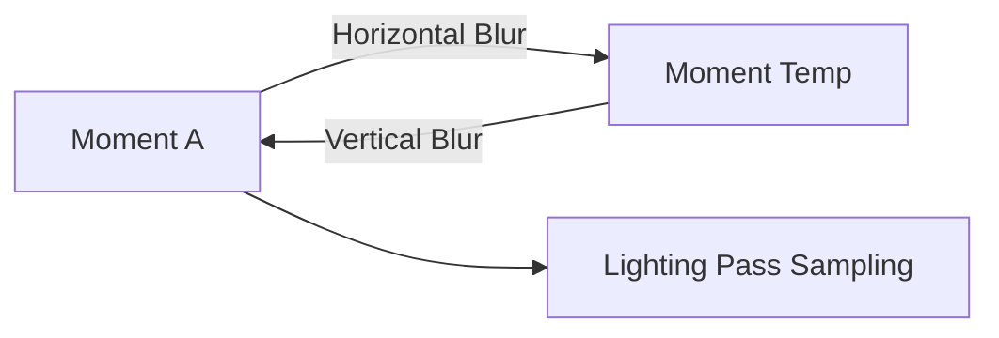

가중치는 다음과 같다.

```hlsl
w0 = 0.25
w1 = 0.50
w2 = 0.25
```

Local Atlas에서는 전체 Texture가 아니라 할당된 Atlas Rect 단위로 Blur한다.

Directional Shadow Array에서는 Slice별로 Horizontal / Vertical Blur를 수행한다.

---

## 16. Bias와 Artifact

발표자료에서 설명한 Artifact는 현재 구현에도 직접 반영되어 있다.

| Artifact | 원인 | 대응 |
| --- | --- | --- |
| Shadow Acne | 같은 표면을 shadow caster/receiver로 비교하면서 생기는 오차 | Constant Bias |
| Peter Panning | Bias가 과도해 그림자가 물체에서 떨어짐 | Bias 조절 |
| 경사면 오차 | Light 방향과 표면 normal이 기울어질수록 depth 오차 증가 | Slope Bias |
| VSM Light Bleeding | Moment 기반 확률 추정의 한계 | Bleeding Reduction |

Shader에서는 다음처럼 Bias를 계산한다.

```hlsl
float slope = 1.0f - saturate(dot(normalize(N), normalize(L)));
float bias = (shadow.Bias / 1000.0f) + (shadow.SlopeBias / 1000.0f) * slope;
```

Directional Shadow도 normal과 light direction을 이용해 slope factor를 계산한다.

---

## 17. Shadow Sharpen

Shadow Sharpen은 Shadow Filtering 후 나온 visibility 값을 다시 조정해 경계가 과하게 흐려지는 것을 줄이는 후처리다.

```hlsl
float ApplyShadowSharpen(float visibility, float sharpen)
{
    float width = lerp(0.5f, 0.05f, saturate(sharpen));
    float edge0 = 0.5f - width * 0.5f;
    float edge1 = 0.5f + width * 0.5f;
    return smoothstep(edge0, edge1, saturate(visibility));
}
```

`ShadowSharpen` 값이 커질수록 `smoothstep` 구간이 좁아져 경계가 더 날카롭게 보인다.

---

## 18. Forward Lighting에서 Shadow 적용

Shadow visibility는 전체 final color에 한 번 곱하지 않고, 각 Light contribution에 곱한다.

Directional Light는 다음 구조다.

```hlsl
float dirShadow = CalcDirectionalShadow(worldPos, N, screenPos);
result += CalcDirectionalDiffuse(...) * dirShadow;
```

Point / Spot Light도 Light별로 Shadow를 샘플링한다.

```hlsl
result += CalcLightDiffuse(light, worldPos, N) * CalcLocalShadow(lightIndex, light, worldPos, N);
```

이 구조에서는 Light A가 만든 Shadow가 Light B의 직접광까지 어둡게 만들지 않는다. 즉 여러 Light가 동시에 존재할 때 각 Light의 Shadow는 해당 Light contribution에만 적용된다.

---

## 19. Editor UI와 Debug 기능

### Light Property Shadow Preview

Light Property에서는 현재 Light의 Shadow Map을 볼 수 있다.

| Light | Preview |
| --- | --- |
| Directional | PSM 또는 CSM Slice |
| Spot | Atlas Tile |
| Point | 선택 Face의 Atlas Tile |

Preview는 `FEditorPropertyWidget`에서 처리한다.

Depth Preview는 `ShadowDepthPreview.hlsl`을 통해 R 채널로 표시한다.

### Override Camera With Light Perspective

Light Property에서 `Override camera with light's perspective`를 체크하면, Editor Camera가 해당 Light의 Shadow View로 이동한다.

| Light | Override 방식 |
| --- | --- |
| Spot | Spot Light Shadow View |
| Point | 선택된 Face View |
| Directional PSM | CSM처럼 볼 수 있는 Ortho inspection View |
| Directional CSM | 선택 Cascade View |

Override 중에는 선택 Light의 Billboard / Gizmo가 시야를 가리지 않도록 숨겨진다. 해제 시 기존 카메라 위치, 회전, FOV, Ortho Width를 복구한다.

### Local Shadow Atlas Panel

`FLevelViewportLayout::RenderLocalShadowAtlasPanel`은 전체 Local Shadow Atlas를 보여준다.

Atlas 위에는 할당된 Rect가 표시된다.

- Green: Spot
- Orange: Point Face

---

## 20. Console Command와 Stat

현재 Shadow 관련 Console Command는 `EditorConsoleWidget.cpp`에서 처리한다.

### Filter 변경

```text
shadow_filter VSM
shadow_filter ESM
shadow_filter PCF_BOX
shadow_filter PCF_POI
shadow_filter NONE
```

또는 통합 명령으로 다음 형태를 사용할 수 있다.

```text
shadow filter vsm
shadow filter esm
shadow filter pcf_box
shadow filter pcf_poi
```

### Directional Shadow Mode

```text
shadow dirmode psm
shadow dirmode csm
```

### Cascade Debug

```text
shadow debug_cascades 1
shadow debug_cascades 0
```

### Stat

```text
stat shadow
stat csm
```

`stat shadow`는 Shadow Filter, Local Atlas 사용량, Light 개수, VRAM 추정치를 표시한다.

`stat csm`은 Cascade 관련 정보를 표시한다.

---

## 21. Resource Path 정리

### PCF

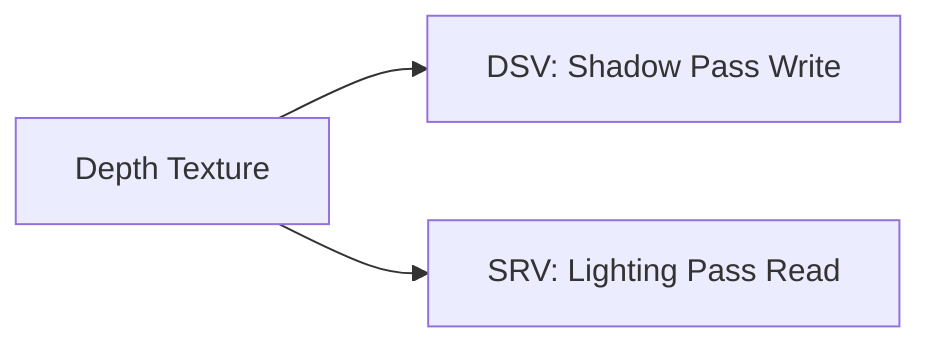

PCF는 별도 RTV가 필요 없다.

### VSM / ESM

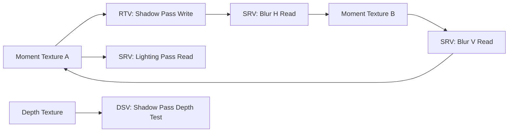

VSM / ESM은 같은 Texture를 같은 Pass에서 SRV와 RTV로 동시에 바인딩하지 않도록 Pass 전환 시 unbind를 수행한다.

---

## 22. Shader Register 요약

주요 Shadow 관련 바인딩은 다음과 같다.

| Resource | 용도 |
| --- | --- |
| `ShadowMapAtlasTexture` | Local Shadow Atlas |
| `DirectionalShadowArray` | Directional PSM / CSM Array |
| `LocalLights` | Local Shadow Info Structured Buffer |
| `LightingConstantBuffer` | Shadow Filter Mode, ESM exponent 등 |
| `PSMShadowBuffer b2` | PSM Shadow Pass 전용 MainVP / LightVP |
| `ShadowBlurCB b2` | Moment Blur Pass용 파라미터 |

---

## 23. 현재 구현의 장점

1. Directional과 Local Light Shadow 자원이 분리되어 있다.
2. Local Light는 Atlas 하나로 묶어 SRV 바인딩 수를 줄인다.
3. PCF / VSM / ESM을 Runtime Filter Mode로 전환할 수 있다.
4. VSM / ESM은 Ping-Pong Blur Pass를 가진다.
5. Point Light는 Face별 Shadow View로 관리된다.
6. Shadow Preview와 Override Camera를 통해 디버깅이 가능하다.
7. `stat shadow`, `stat csm`으로 메모리와 Light 개수 확인이 가능하다.

---

## 24. 현재 구현의 제한과 후속 개선점

현재 구조는 발표와 테스트를 위한 기능 구현에 초점을 맞추고 있다. 후속으로 개선할 수 있는 부분은 다음과 같다.

| 항목 | 현재 상태 | 후속 개선 |
| --- | --- | --- |
| Local Atlas Allocation | 매 프레임 재배치 | Persistence / Repack / Eviction |
| Point Face Culling | Face별 caster 여부 검사 일부 적용 | Frame 단위 caster list 저장 |
| Directional Caster Culling | PSM은 CPU frustum culling 제한 | Directional 전용 caster volume |
| CSM Boundary | Cascade 선택 중심 | Cascade blending |
| ESM Resource | VSM과 같은 RG32 경로 | R32_FLOAT 최적화 가능 |
| Shadow Cache | 매 프레임 렌더 | Static caster cache / update frequency |

---

## 25. 주요 파일 목록

| 영역 | 파일 |
| --- | --- |
| Shadow Data | `KraftonEngine/Source/Engine/Render/Types/ShadowData.h` |
| Shadow Options | `KraftonEngine/Source/Engine/Render/Types/RenderTypes.h` |
| Shadow Renderer | `KraftonEngine/Source/Engine/Render/Pipeline/ShadowRenderer.cpp` |
| Shadow Resource Manager | `KraftonEngine/Source/Engine/Render/Resource/ShadowResourceManager.cpp` |
| Local Request Planner | `KraftonEngine/Source/Engine/Render/Resource/LocalShadowRequestPlanner.cpp` |
| Local Allocation Executor | `KraftonEngine/Source/Engine/Render/Resource/LocalShadowAllocationExecutor.cpp` |
| Local Atlas Allocator | `KraftonEngine/Source/Engine/Render/Resource/LocalShadowAtlasAllocator.h` |
| Forward Lighting Shader | `KraftonEngine/Shaders/Common/ForwardLighting.hlsli` |
| Depth Shadow Shader | `KraftonEngine/Shaders/Shadow/CommonShadowMap.hlsl` |
| Moment Shadow Shader | `KraftonEngine/Shaders/Shadow/MomentShadowMap.hlsl` |
| PSM Shadow Shader | `KraftonEngine/Shaders/Shadow/PSMCommonShadowMap.hlsl` |
| PSM Moment Shader | `KraftonEngine/Shaders/Shadow/PSMMomentShadowMap.hlsl` |
| Moment Blur Shader | `KraftonEngine/Shaders/Shadow/ShadowMomentBlur.hlsl` |
| Shadow Preview Shader | `KraftonEngine/Shaders/Editor/ShadowDepthPreview.hlsl` |
| Light Property UI | `KraftonEngine/Source/Editor/UI/EditorPropertyWidget.cpp` |
| Atlas Panel UI | `KraftonEngine/Source/Editor/Viewport/FLevelViewportLayout.cpp` |
| Console Command | `KraftonEngine/Source/Editor/UI/EditorConsoleWidget.cpp` |
| Stat Overlay | `KraftonEngine/Source/Editor/Subsystem/OverlayStatSystem.cpp` |

---

## 26. 발표자료와 구현 연결 요약

발표자료의 `Local Light Shadow` 파트는 `Point Light 6 Face`, `Spot Light 1 View`, `Local Shadow Atlas` 구현과 연결된다.

발표자료의 `Directional Light Shadow` 파트는 `PSM`, `CSM`, `DirectionalShadowArray` 구현과 연결된다.

발표자료의 `Shadow Artifact` 파트는 `ShadowBias`, `ShadowSlopeBias`, `VSM Light Bleeding Reduction`과 연결된다.

발표자료의 `Anti-aliasing` 파트는 `PCF_BOX`, `PCF_POISSON`, `VSM`, `ESM` Filter Mode와 연결된다.

발표자료의 `Shadow Sharpen` 파트는 `ApplyShadowSharpen` 함수와 `ULightComponent::ShadowSharpen` Editor Property와 연결된다.

