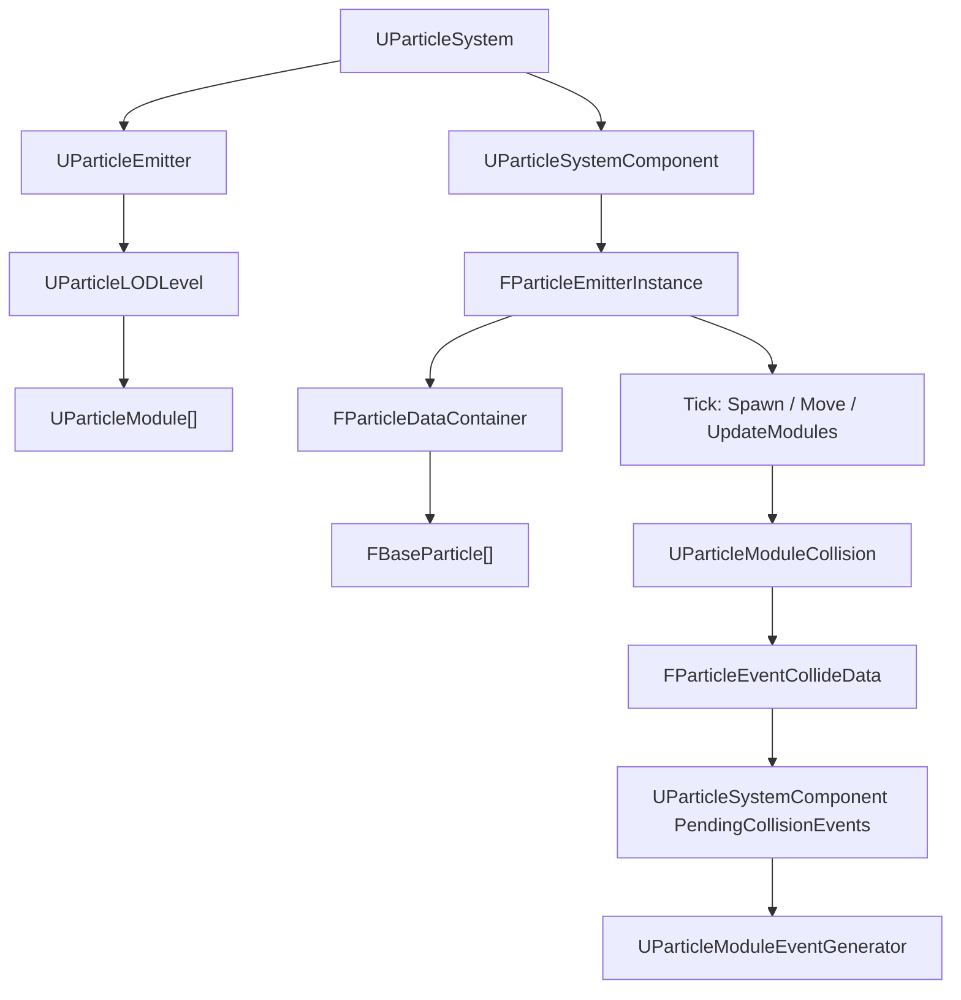
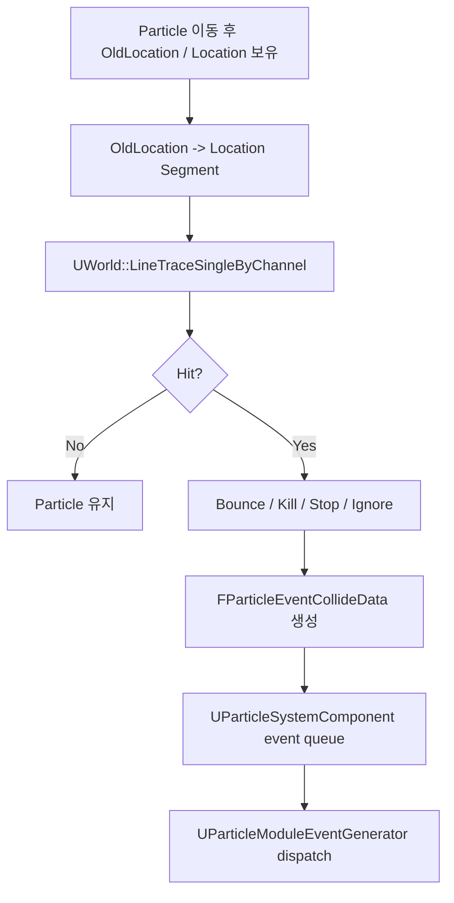
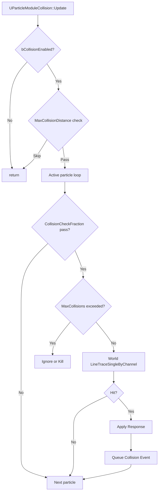

# Particle Collision World Trace Plan

> 목적: 현재 Plane 기반 Particle Collision을 제거하고, UE Cascade의 CPU particle collision 흐름처럼 `World` trace API 기반의 collision module로 확장한다.
> 작성일: 2026-05-26

## 0. 구현 상태

2026-05-26 기준 1차 구현 완료:

- [x] `FCollisionQueryParams` 추가
- [x] `UWorld::LineTraceSingle` 추가
- [x] `UParticleModuleCollision`을 world trace 기반으로 전환
- [x] `Bounce`, `Kill`, `Stop`, `Ignore` response 추가
- [x] `Restitution`, `Friction` response 계산 적용
- [x] `MaxCollisions`, `MaxCollisionDistance`, `CollisionCheckFraction` 적용
- [x] collision event에 `HitComponent`, `HitActor`, `FHitResult` 기록
- [x] `UParticleModuleEventGenerator`에 collision event dispatch 토글 추가
- [x] `UBoxComponent::RaycastMesh` OBB raycast 구현
- [x] `USphereComponent::RaycastMesh` sphere raycast 구현
- [x] `GameClientRelease` 빌드 통과

남은 확장 후보:

- [ ] 실제 channel response matrix
- [ ] sphere/capsule sweep
- [ ] debug line rendering
- [ ] collision stat
- [ ] Lua trace API 노출

## 1. 현재 구조 요약

현재 Particle runtime 흐름은 다음 구조를 따른다.



핵심 파일:

- `JSEngine/Source/Engine/Particle/ParticleEmitterInstance.cpp`
- `JSEngine/Source/Engine/Particle/ParticleModules.h`
- `JSEngine/Source/Engine/Particle/ParticleModules.cpp`
- `JSEngine/Source/Engine/Particle/ParticleTypes.h`
- `JSEngine/Source/Engine/Particle/ParticleSystemComponent.h`
- `JSEngine/Source/Engine/Particle/ParticleSystemComponent.cpp`

현재 `UParticleModuleCollision`은 `CollisionPlaneZ` 기준의 간이 plane collision만 처리한다.

현재 구현의 한계:

- 실제 `UWorld`의 primitive/component와 충돌하지 않는다.
- `HitActor`, `HitComponent`가 실질적으로 채워지지 않는다.
- Sprite particle의 이동 구간과 world object 사이의 trace가 없다.
- Collision response가 `Z`축 bounce 중심으로 고정되어 있다.
- 성능 제어 옵션이 없다.

## 2. 목표 구조

Plane collision은 최종 기능에서 제외하고, `World` collision만 메인으로 둔다.

목표 흐름:



설계 원칙:

- Particle module은 collision query 구현 세부를 직접 알지 않는다.
- Collision query는 `UWorld` 공용 API에 둔다.
- Particle collision은 `OldLocation -> Location` segment trace를 사용한다.
- Sprite particle 자체를 OBB collider로 취급하지 않는다.
- 1차 구현은 point particle trace다.
- Sphere/capsule sweep은 후속 확장으로 둔다.

## 3. UE식 참고 방향

UE Cascade CPU Particle Collision에서 참고할 개념:

- Particle은 이전 위치와 현재 위치를 기준으로 movement segment를 만든다.
- `ParticleLineCheck` 또는 line trace 계열 query로 world collision을 검사한다.
- 충돌 결과는 `FHitResult`류 구조로 받는다.
- Collision module은 response와 event payload 생성을 담당한다.
- Event generator는 queued event를 외부로 dispatch한다.

우리 엔진에 맞춘 대응:

| UE 개념 | 우리 엔진 대응 |
| --- | --- |
| `LineTraceSingleByChannel` | `UWorld::LineTraceSingleByChannel` 신규 추가 |
| `FHitResult` | `JSEngine/Source/Engine/Core/CollisionTypes.h`의 `FHitResult` |
| Collision channel | `ECollisionChannel` 신규 추가, 1차에서는 필터 최소화 |
| Collision query params | `FCollisionQueryParams` 신규 추가 |
| Particle collision module | `UParticleModuleCollision` 확장 |
| Particle event generator | `UParticleModuleEventGenerator` 유지/정리 |

## 4. 필요한 기술 개념

### Ray

`Origin + Direction`으로 표현되는 반직선이다.

```text
Origin ---- Direction ---->
```

끝점이 없으므로, 그대로 쓰면 particle이 이번 프레임에 이동한 구간보다 훨씬 먼 물체도 맞을 수 있다.

### Segment

시작점과 끝점이 모두 있는 유한한 선분이다.

```text
Start -------- End
```

Particle collision에서는 `Particle.OldLocation -> Particle.Location`이 segment다.

### Line Trace

게임 엔진에서 흔히 쓰는 `Start -> End` 구간 충돌 검사다.

수학적으로는 segment query에 가깝다.

### Raycast

Ray를 쏴서 충돌 후보와 교차하는지 검사한다.

우리 엔진의 `UPrimitiveComponent::Raycast`는 ray 기반이므로, particle collision에서는 반드시 segment 길이 제한을 걸어야 한다.

```cpp
Hit.Distance <= SegmentLength
```

### Sweep

점이 아니라 sphere, capsule, box 같은 부피를 가진 shape를 `Start -> End`로 움직이며 충돌 검사하는 방식이다.

1차 구현에서는 하지 않는다. 추후 particle radius를 더 정확히 처리할 때 고려한다.

### Broad Phase / Narrow Phase

Broad phase:

- 빠른 후보 필터링 단계
- 우리 엔진에서는 `FWorldSpatialIndex::RayQueryPrimitives`
- BVH/AABB 기준으로 맞을 가능성이 있는 primitive를 찾는다.

Narrow phase:

- 실제 primitive별 정밀 검사 단계
- 우리 엔진에서는 `UPrimitiveComponent::Raycast`

## 5. 신규/수정 API 명세

### 5.1 `ECollisionChannel`

위치 후보:

- `JSEngine/Source/Engine/Core/CollisionTypes.h`

```cpp
enum class ECollisionChannel : uint8
{
    Visibility,
    WorldStatic,
    WorldDynamic,
    Particle
};
```

1차 구현에서는 channel 값을 받되, 실제 channel response matrix는 만들지 않는다.

후속 확장:

- `UPrimitiveComponent`에 object channel 추가
- `UPrimitiveComponent`에 trace response 추가
- `LineTraceSingleByChannel`에서 channel filtering 적용

### 5.2 `FCollisionQueryParams`

위치 후보:

- `JSEngine/Source/Engine/Core/CollisionTypes.h`

```cpp
struct FCollisionQueryParams
{
    AActor* IgnoredActor = nullptr;
    UPrimitiveComponent* IgnoredComponent = nullptr;
    bool bTraceVisibleOnly = true;
};
```

필요 이유:

- Particle owner를 무시할 수 있어야 한다.
- 특정 component를 무시할 수 있어야 한다.
- visible component만 trace할지 제어할 수 있어야 한다.

### 5.3 `UWorld::LineTraceSingleByChannel`

위치:

- 선언: `JSEngine/Source/Engine/GameFramework/World.h`
- 구현: `JSEngine/Source/Engine/GameFramework/World.cpp`

```cpp
bool LineTraceSingleByChannel(
    const FVector& Start,
    const FVector& End,
    ECollisionChannel Channel,
    FHitResult& OutHit,
    const FCollisionQueryParams& Params = FCollisionQueryParams());
```

1차 동작:

1. `OutHit.Reset()`
2. `Delta = End - Start`
3. `SegmentLength = Delta.Length()`
4. 길이가 너무 짧으면 false
5. `FRay(Start, Delta / SegmentLength)` 생성
6. `SpatialIndex.RayQueryPrimitives`로 후보 수집
7. 후보마다 ignore 조건 확인
8. 후보마다 `Candidate->Raycast(Ray, Hit)` 호출
9. `Hit.bHit && Hit.Distance <= SegmentLength`만 인정
10. 가장 가까운 hit을 `OutHit`에 저장
11. `OutHit.HitComponent`가 비어 있으면 candidate로 보정
12. hit 여부 반환

Pseudo code:

```cpp
bool UWorld::LineTraceSingleByChannel(
    const FVector& Start,
    const FVector& End,
    ECollisionChannel Channel,
    FHitResult& OutHit,
    const FCollisionQueryParams& Params)
{
    (void)Channel; // 1차 구현에서는 channel filtering 미적용
    OutHit.Reset();

    const FVector Delta = End - Start;
    const float SegmentLength = Delta.Length();
    if (SegmentLength <= KINDA_SMALL_NUMBER)
    {
        return false;
    }

    FRay Ray(Start, Delta / SegmentLength);

    TArray<UPrimitiveComponent*> Candidates;
    TArray<float> CandidateTs;
    FWorldSpatialIndex::FPrimitiveRayQueryScratch Scratch;
    SpatialIndex.RayQueryPrimitives(Ray, Candidates, CandidateTs, Scratch);

    bool bFoundHit = false;
    float BestDistance = SegmentLength;

    for (UPrimitiveComponent* Candidate : Candidates)
    {
        if (!Candidate)
        {
            continue;
        }
        if (Params.IgnoredComponent && Candidate == Params.IgnoredComponent)
        {
            continue;
        }
        if (Params.IgnoredActor && Candidate->GetOwner() == Params.IgnoredActor)
        {
            continue;
        }
        if (Params.bTraceVisibleOnly && !Candidate->IsVisible())
        {
            continue;
        }

        FHitResult Hit;
        if (Candidate->Raycast(Ray, Hit) && Hit.bHit && Hit.Distance <= SegmentLength && Hit.Distance < BestDistance)
        {
            if (!Hit.HitComponent)
            {
                Hit.HitComponent = Candidate;
            }
            OutHit = Hit;
            BestDistance = Hit.Distance;
            bFoundHit = true;
        }
    }

    return bFoundHit;
}
```

## 6. Particle Collision Module 명세

위치:

- `JSEngine/Source/Engine/Particle/ParticleModules.h`
- `JSEngine/Source/Engine/Particle/ParticleModules.cpp`

### 6.1 Response enum

위치 후보:

- `ParticleTypes.h` 또는 `ParticleModules.h`

```cpp
enum class EParticleCollisionResponse : uint8
{
    Bounce,
    Kill,
    Stop,
    Ignore
};
```

### 6.2 `UParticleModuleCollision` 속성

Plane 관련 속성은 제거한다.

```cpp
UPROPERTY(DisplayName = "Collision Enabled")
bool bCollisionEnabled = true;

UPROPERTY(DisplayName = "Trace Channel")
ECollisionChannel TraceChannel = ECollisionChannel::WorldStatic;

UPROPERTY(DisplayName = "Response")
EParticleCollisionResponse Response = EParticleCollisionResponse::Bounce;

UPROPERTY(DisplayName = "Restitution", Min = 0.0f, Max = 1.0f)
float Restitution = 0.25f;

UPROPERTY(DisplayName = "Friction", Min = 0.0f, Max = 1.0f)
float Friction = 0.0f;

UPROPERTY(DisplayName = "Max Collisions", Min = 0)
int32 MaxCollisions = 0;

UPROPERTY(DisplayName = "Kill On Max Collisions")
bool bKillWhenMaxCollisionsReached = false;

UPROPERTY(DisplayName = "Max Collision Distance", Min = 0.0f)
float MaxCollisionDistance = 0.0f;

UPROPERTY(DisplayName = "Collision Check Fraction", Min = 0.0f, Max = 1.0f)
float CollisionCheckFraction = 1.0f;

UPROPERTY(DisplayName = "Ignore Owner")
bool bIgnoreOwner = true;

UPROPERTY(DisplayName = "Generate Events")
bool bGenerateCollisionEvents = true;
```

### 6.3 Update 흐름



Pseudo code:

```cpp
void UParticleModuleCollision::Update(FParticleEmitterInstance* Owner, float DeltaTime)
{
    (void)DeltaTime;
    if (!bCollisionEnabled || !Owner)
    {
        return;
    }

    UParticleSystemComponent* Component = Owner->GetOwningComponent();
    AActor* OwnerActor = Component ? Component->GetOwner() : nullptr;
    UWorld* World = OwnerActor ? OwnerActor->GetFocusedWorld() : nullptr;
    if (!World)
    {
        return;
    }

    if (MaxCollisionDistance > 0.0f && Owner->GetCurrentLODDistance() > MaxCollisionDistance)
    {
        return;
    }

    for (int32 ParticleIndex = 0; ParticleIndex < Owner->GetActiveParticleCount();)
    {
        FBaseParticle& Particle = *Owner->GetParticle(ParticleIndex);

        if (!ShouldCheckParticle(Particle))
        {
            ++ParticleIndex;
            continue;
        }

        if (MaxCollisions > 0 && Particle.CollisionCount >= MaxCollisions)
        {
            if (bKillWhenMaxCollisionsReached)
            {
                Owner->KillParticle(ParticleIndex);
                continue;
            }
            ++ParticleIndex;
            continue;
        }

        FHitResult Hit;
        FCollisionQueryParams Params;
        Params.IgnoredActor = bIgnoreOwner ? OwnerActor : nullptr;

        if (World->LineTraceSingleByChannel(Particle.OldLocation, Particle.Location, TraceChannel, Hit, Params))
        {
            ApplyCollisionResponse(Owner, ParticleIndex, Particle, Hit);
            if (bGenerateCollisionEvents)
            {
                QueueCollisionEvent(Owner, Particle, Hit);
            }

            if (Response == EParticleCollisionResponse::Kill)
            {
                continue;
            }
        }

        ++ParticleIndex;
    }
}
```

`GetCurrentLODDistance()`는 현재 없으면 바로 추가하지 않아도 된다. 1차에서는 `MaxCollisionDistance` 옵션을 보류하거나, component/camera 거리 계산을 module 내부에서 임시 계산한다.

## 7. Collision Response 명세

### Bounce

Normal 방향 속도는 반사하고, tangent 방향 속도는 friction으로 감쇠한다.

```cpp
FVector N = Hit.Normal.GetSafeNormal();
FVector V = Particle.Velocity;

const float NormalSpeed = FVector::DotProduct(V, N);
const FVector Vn = N * NormalSpeed;
const FVector Vt = V - Vn;

if (NormalSpeed < 0.0f)
{
    Particle.Velocity = Vt * std::max(0.0f, 1.0f - Friction) - Vn * Restitution;
}

Particle.Location = Hit.Location + N * 0.1f;
```

### Kill

```cpp
Owner->KillParticle(ParticleIndex);
```

주의:

- `KillParticle`는 swap-pop 방식이다.
- kill 후에는 `ParticleIndex`를 증가시키지 않는다.

### Stop

```cpp
Particle.Location = Hit.Location + Hit.Normal.GetSafeNormal() * 0.1f;
Particle.Velocity = FVector::ZeroVector;
```

### Ignore

물리 반응은 하지 않는다.

옵션에 따라 event만 생성할 수 있다.

## 8. Collision Event 명세

`FParticleEventCollideData` 채우기:

```cpp
FParticleEventCollideData Event;
Event.Component = Owner->GetOwningComponent();
Event.EmitterInstance = Owner;
Event.EmitterIndex = Owner->GetEmitterIndex();
Event.ParticleId = Particle.ParticleId;
Event.Location = Particle.Location;
Event.OldLocation = Particle.OldLocation;
Event.Velocity = Particle.Velocity;
Event.Normal = Hit.Normal.GetSafeNormal();
Event.HitComponent = Hit.HitComponent;
Event.HitActor = Hit.HitComponent ? Hit.HitComponent->GetOwner() : nullptr;
Event.Time = Particle.RelativeTime;
Event.Hit = Hit;
Owner->QueueCollisionEvent(Event);
```

`UParticleModuleEventGenerator`는 다음 역할만 담당한다.

- `UParticleSystemComponent`에 쌓인 collision event를 dispatch한다.
- 1차에서는 collision event만 지원한다.
- Spawn/death event는 후속 확장으로 둔다.

주의:

- 현재 EventGenerator는 update module이므로 module 순서에 영향을 받는다.
- 같은 프레임 dispatch를 보장하려면 Collision module 뒤에 있어야 한다.
- 장기적으로는 update module 실행 후 component queue를 자동 dispatch하는 방식도 검토 가능하다.

## 9. 성능 옵션 명세

### LOD별 Collision 끄기

가장 자연스러운 방식:

- `UParticleLODLevel`별로 `UParticleModuleCollision`을 넣거나 빼면 된다.
- 멀리 있는 LOD에는 Collision module을 추가하지 않는다.

장점:

- 기존 구조와 맞다.
- 별도 flag 없이 editor asset 구성만으로 제어 가능하다.

### MaxCollisionDistance

목적:

- 카메라 또는 emitter와 멀리 떨어진 particle system의 collision update를 skip한다.

1차 선택:

- `FParticleEmitterInstance`에 현재 LOD distance를 저장하면 깔끔하다.
- 당장 어렵다면 옵션을 선언만 하고 구현은 2차로 미룬다.

### CollisionCheckFraction

목적:

- 모든 particle을 매 프레임 trace하지 않고 일부만 검사한다.

권장 방식:

```cpp
bool ShouldCheckParticle(const FBaseParticle& Particle) const
{
    if (CollisionCheckFraction >= 1.0f)
    {
        return true;
    }
    if (CollisionCheckFraction <= 0.0f)
    {
        return false;
    }

    const uint32 BucketCount = 100;
    const uint32 Threshold = static_cast<uint32>(CollisionCheckFraction * BucketCount);
    const uint32 Bucket = Particle.ParticleId % BucketCount;
    return Bucket < Threshold;
}
```

장점:

- deterministic하다.
- 별도 random state가 필요 없다.

단점:

- 특정 particle은 계속 검사되고 특정 particle은 계속 빠질 수 있다.
- 후속으로 frame counter를 섞어 rolling fraction을 만들 수 있다.

### MaxCollisions

목적:

- 너무 많이 튕기는 particle을 제한한다.

정책:

- `MaxCollisions == 0`: 무제한
- `Particle.CollisionCount >= MaxCollisions`: 더 이상 collision 검사하지 않음
- `bKillWhenMaxCollisionsReached == true`: 제한 도달 시 kill

### MaxCollisionChecksPerFrame

1차에서는 보류한다.

이유:

- 단순히 앞에서부터 N개만 검사하면 particle index 편향이 생긴다.
- rolling offset이 필요하다.
- `FParticleEmitterInstance`에 collision scan offset 같은 runtime state가 필요하다.

후속 확장 후보:

```cpp
int32 MaxCollisionChecksPerFrame = 0; // 0이면 무제한
int32 CollisionCheckCursor = 0;       // instance runtime state
```

## 10. 작업 배치 계획

### Batch 1: World Trace API

목표:

- `UWorld::LineTraceSingleByChannel` 공용 API 추가

수정 파일:

- `JSEngine/Source/Engine/Core/CollisionTypes.h`
- `JSEngine/Source/Engine/GameFramework/World.h`
- `JSEngine/Source/Engine/GameFramework/World.cpp`

작업:

- [ ] `ECollisionChannel` 추가
- [ ] `FCollisionQueryParams` 추가
- [ ] `UWorld::LineTraceSingleByChannel` 선언 추가
- [ ] `UWorld::LineTraceSingleByChannel` 구현 추가
- [ ] segment length 제한 적용
- [ ] ignored actor/component 처리
- [ ] closest hit 선택

검증:

- [ ] 기존 build 통과
- [ ] editor picking/raycast 기존 동작 회귀 없음

### Batch 2: Collision Module World Trace 전환

목표:

- `UParticleModuleCollision`을 world collision 기반으로 변경

수정 파일:

- `JSEngine/Source/Engine/Particle/ParticleModules.h`
- `JSEngine/Source/Engine/Particle/ParticleModules.cpp`
- 필요 시 `JSEngine/Source/Engine/Particle/ParticleTypes.h`

작업:

- [ ] `EParticleCollisionResponse` 추가
- [ ] Plane 관련 속성 제거 또는 legacy 숨김
- [ ] `TraceChannel` 속성 추가
- [ ] `Response`, `Restitution`, `Friction` 속성 추가
- [ ] `MaxCollisions`, `CollisionCheckFraction` 속성 추가
- [ ] `OldLocation -> Location` line trace 호출
- [ ] `Bounce/Kill/Stop/Ignore` response 구현
- [ ] `CollisionCount` 증가 처리

검증:

- [ ] particle이 world primitive에 충돌한다.
- [ ] bounce response가 정상 동작한다.
- [ ] kill response가 active particle swap-pop과 충돌하지 않는다.
- [ ] stop response가 표면에 고정된다.

### Batch 3: Collision Event 정리

목표:

- Collision event data를 실제 world hit 정보로 채운다.

수정 파일:

- `JSEngine/Source/Engine/Particle/ParticleModules.cpp`
- `JSEngine/Source/Engine/Particle/ParticleSystemComponent.cpp`
- 필요 시 `JSEngine/Source/Engine/Particle/ParticleEvent.cpp`

작업:

- [ ] `FParticleEventCollideData::HitComponent` 채우기
- [ ] `FParticleEventCollideData::HitActor` 채우기
- [ ] `FParticleEventCollideData::Hit` 채우기
- [ ] `UParticleModuleEventGenerator` 역할 문서화
- [ ] EventGenerator module 순서 문제 확인

검증:

- [ ] collision event queue에 event가 들어간다.
- [ ] EventGenerator가 dispatch하면 queue가 비워진다.
- [ ] event에서 `HitComponent`, `HitActor`, `Normal`, `Location`을 확인할 수 있다.

### Batch 4: 성능 옵션

목표:

- 대량 particle에서 collision cost를 제어할 수 있게 한다.

수정 파일:

- `JSEngine/Source/Engine/Particle/ParticleModules.h`
- `JSEngine/Source/Engine/Particle/ParticleModules.cpp`
- 필요 시 `JSEngine/Source/Engine/Particle/ParticleEmitterInstance.h/.cpp`

작업:

- [ ] `CollisionCheckFraction` 적용
- [ ] `MaxCollisions` 적용
- [ ] `bKillWhenMaxCollisionsReached` 적용
- [ ] `MaxCollisionDistance` 적용 여부 결정
- [ ] LOD별 collision module 제거 방식 문서화

검증:

- [ ] `CollisionCheckFraction = 0.0`이면 collision이 발생하지 않는다.
- [ ] `CollisionCheckFraction = 1.0`이면 모든 active particle이 검사 대상이다.
- [ ] `MaxCollisions` 도달 후 추가 bounce가 발생하지 않는다.
- [ ] LOD에서 Collision module을 제거하면 collision update가 수행되지 않는다.

### Batch 5: Editor / Asset 확인

목표:

- Editor에서 Collision/EventGenerator module 설정이 자연스럽게 보이는지 확인한다.

수정 파일:

- `JSEngine/Source/Editor/UI/EditorParticleSystemWidget.cpp`
- 필요 시 reflection/property metadata 관련 파일

작업:

- [ ] Collision module add menu 유지
- [ ] EventGenerator module add menu 유지
- [ ] 새 enum/property가 property panel에 표시되는지 확인
- [ ] Plane 관련 property가 노출되지 않도록 정리
- [ ] EventGenerator가 Collision 뒤에 오도록 add 순서 정책 검토

검증:

- [ ] editor에서 Collision module 추가 가능
- [ ] response/restition/friction 설정 가능
- [ ] 저장/로드 후 property 유지

## 11. 1차 완료 기준

최소 성공 기준:

- `UWorld::LineTraceSingleByChannel`이 존재한다.
- Particle collision module이 plane이 아니라 world trace를 사용한다.
- `OldLocation -> Location` segment 안에서만 collision이 인정된다.
- `Bounce`, `Kill`, `Stop` 중 최소 `Bounce`, `Kill`이 동작한다.
- Collision event에 `HitComponent`, `HitActor`, `FHitResult`가 채워진다.
- `CollisionCheckFraction`, `MaxCollisions` 중 최소 하나 이상의 성능 옵션이 동작한다.

발표 가능 문장:

> Particle Collision은 UE Cascade의 CPU collision 흐름을 참고해 `OldLocation -> Location` segment trace 기반으로 구현했다. Query는 `UWorld::LineTraceSingleByChannel`에 공용 API로 분리했고, Collision Module은 response와 event payload 생성을 담당한다. 대량 particle 비용을 줄이기 위해 LOD별 module 구성, collision check fraction, max collision count 같은 성능 옵션을 제공한다.

## 12. 후속 확장 후보

- 실제 collision channel/response matrix
- sphere sweep 기반 particle radius collision
- `MaxCollisionChecksPerFrame`와 rolling cursor
- spawn/death event generator
- Lua `World.LineTrace` API 노출
- debug line rendering
- collision stat: checked particle count, hit count, skipped count
