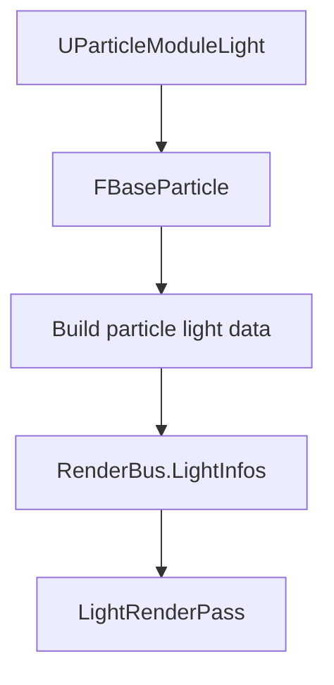
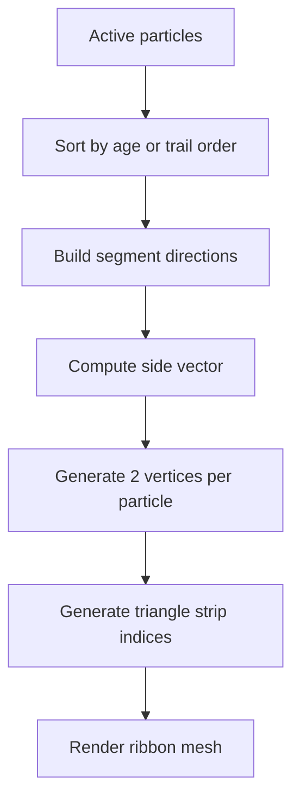
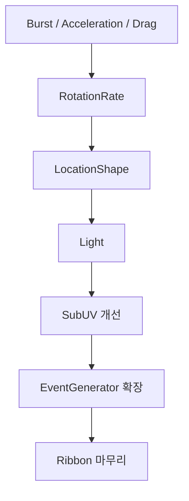
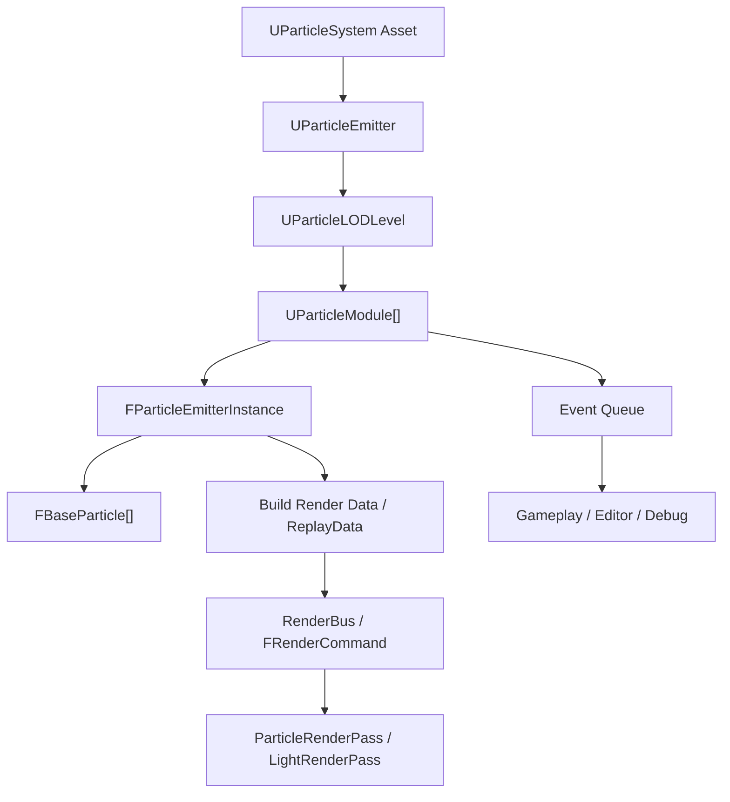

# Particle Module Expansion Plan

> 목적: 현재 CPU Particle 구조 위에 게임 제작과 발표 가치가 높은 모듈을 추가하기 위한 구현 범위와 공부 항목을 정리한다.
> 작성일: 2026-05-26

## 1. 현재 전제

- Particle simulation은 CPU에서 `FParticleEmitterInstance`가 active particle을 직접 순회한다.
- 각 particle의 기본 상태는 `FBaseParticle`에 있다.
- Render data는 현재 `BuildInstanceData()`에서 Sprite/Mesh/Ribbon/Beam별 instance buffer로 만들어진다.
- Light는 renderer에 이미 `FLightInfo` 배열과 `RenderBus.LightInfos` 경로가 있다.
- 팀원이 ReplayData 구조를 새로 만들고 있다면, 이 문서의 모듈들은 ReplayData 내부 구현을 직접 소유하지 않고 필요한 데이터 계약만 맞춘다.

## 2. 추천 모듈 우선순위

| 우선순위 | 모듈 | 목적 | 구현 난이도 | 충돌 위험 |
| --- | --- | --- | --- | --- |
| 1 | `UParticleModuleBurst` | 순간적인 폭발/스파크/총구 화염 | 낮음 | 낮음 |
| 2 | `UParticleModuleAcceleration` | 중력, 바람, 지속 가속 | 낮음 | 낮음 |
| 3 | `UParticleModuleDrag` | 공기 저항, 감쇠 | 낮음 | 낮음 |
| 4 | `UParticleModuleRotationRate` | Sprite 회전 변화 | 낮음 | 낮음 |
| 5 | `UParticleModuleLocationShape` | Sphere/Cone/Box spawn shape | 중간 | 낮음 |
| 6 | `UParticleModuleLight` | 불꽃/스파크가 주변을 밝히는 효과 | 중간 | 중간 |
| 7 | `USubUVModule` 개선 | flipbook animation | 중간 | 중간 |
| 8 | `UParticleModuleKillHeight` | 특정 높이 아래/위 particle 제거 | 낮음 | 낮음 |
| 9 | `UParticleModuleEventGenerator` 확장 | Spawn/Death/Collision event | 중간 | 중간 |
| 10 | Ribbon 마무리 | trail, slash, laser, smoke streak | 높음 | 중간 |

## 3. 모듈별 구현 방향

### 3.1 Burst

역할:

- 정해진 시간 또는 emitter 시작 시점에 여러 particle을 한 번에 spawn한다.
- 폭발, 스파크, 피격 이펙트, 총구 화염에 자주 쓰인다.

주요 속성:

```cpp
int32 BurstCount;
float BurstTime;
bool bRepeat;
float RepeatInterval;
```

구현 포인트:

- `UParticleModuleSpawn`의 rate 기반 spawn과 별도로 burst spawn count를 누적해야 한다.
- emitter runtime에 "이미 발동한 burst인지"를 저장할 필요가 있다.
- 단순 구현은 emitter 시작 후 `EmitterTime >= BurstTime`일 때 한 번만 spawn한다.

공부 항목:

- fixed timestep vs variable timestep
- 누적 시간 기반 event trigger
- spawn rate와 burst spawn의 차이

### 3.2 Acceleration

역할:

- particle velocity에 매 frame 일정 가속도를 더한다.
- 중력, 바람, 흡입, 밀어내기 효과의 기본이다.

주요 속성:

```cpp
FVector Acceleration;
bool bApplyInWorldSpace;
```

구현 포인트:

```cpp
Particle.Velocity += Acceleration * DeltaTime;
```

공부 항목:

- 위치, 속도, 가속도의 관계
- explicit Euler integration
- local space vector와 world space vector 변환

### 3.3 Drag

역할:

- velocity를 시간에 따라 줄여 particle이 자연스럽게 감속하게 만든다.
- 연기, 먼지, 불꽃 잔상에 유용하다.

주요 속성:

```cpp
float DragCoefficient;
```

구현 포인트:

선형 감쇠:

```cpp
Particle.Velocity *= max(0.0f, 1.0f - DragCoefficient * DeltaTime);
```

지수 감쇠:

```cpp
Particle.Velocity *= exp(-DragCoefficient * DeltaTime);
```

공부 항목:

- linear damping
- exponential damping
- frame-rate independent interpolation

### 3.4 RotationRate

역할:

- Sprite particle의 `Rotation`을 시간에 따라 갱신한다.
- 불꽃, 나뭇잎, 마법 파편처럼 회전하는 2D particle에 필요하다.

주요 속성:

```cpp
float StartRotationRate;
float RotationRateScaleOverLife;
```

구현 포인트:

```cpp
Particle.Rotation += Particle.RotationRate * DeltaTime;
```

공부 항목:

- degree vs radian
- billboard sprite 회전
- particle local axis와 screen-facing quad

### 3.5 LocationShape

역할:

- particle spawn 위치를 점이 아니라 shape 내부/표면에서 뽑는다.
- Sphere, Cone, Box는 게임 이펙트에서 가장 많이 쓰는 기본 shape다.

주요 속성:

```cpp
EProceduralParticleShape Shape; // Sphere, Cone, Box
bool bSurfaceOnly;
FVector Extents;
float Radius;
float ConeAngle;
float ConeHeight;
```

구현 포인트:

- `Spawn()`에서 `Particle.Location`에 offset을 더한다.
- local space emitter면 component transform을 고려한다.

공부 항목:

- random point in sphere
- random point on sphere surface
- random point in box
- cone direction sampling
- uniform distribution과 naive random의 차이

### 3.6 Light

역할:

- CPU particle에 point light를 붙인 것처럼 주변 환경을 밝힌다.
- 불꽃, 횃불, 전기 스파크, 마법 projectile에 좋다.

UE 대응:

- UE Cascade에도 `UParticleModuleLight`가 있다.
- CPU particle 전용이다.
- Spawn Fraction, Color Scale Over Life, Brightness Over Life, Radius Scale, Light Exponent 같은 속성을 가진다.

주요 속성:

```cpp
bool bUseParticleColor;
FColor LightColor;
float Brightness;
float RadiusScale;
float LightExponent;
float SpawnFraction;
int32 MaxLightsPerEmitter;
bool bAffectsTranslucency;
bool bPreviewLightRadius;
```

구현 포인트:

- particle마다 `UPointLightComponent`를 만들지 않는다.
- active particle에서 임시 light render data를 만들고 `RenderBus.LightInfos`에 append한다.
- shadow는 1차 구현에서 제외한다.
- light 개수 제한은 필수다.

데이터 흐름:



공부 항목:

- point light attenuation
- inverse square falloff
- light radius와 screen overdraw 비용
- particle color to light color
- CPU particle light와 GPU particle light의 차이
- deferred/forward light cost 개념

### 3.7 SubUV 개선

역할:

- texture atlas를 시간에 따라 frame animation한다.
- 불꽃, 폭발, 연기 flipbook에 필수다.

주요 속성:

```cpp
int32 Columns;
int32 Rows;
float FrameRate;
bool bLoop;
```

구현 포인트:

```cpp
float NormalizedAge = Particle.RelativeTime;
int32 Frame = floor(NormalizedAge * TotalFrames);
Particle.SubUVIndex = Frame;
```

공부 항목:

- texture atlas UV remapping
- flipbook animation
- normalized lifetime
- frame index wrapping/clamping
- alpha blending and soft particles

### 3.8 KillHeight

역할:

- 특정 높이 아래 또는 위로 간 particle을 제거한다.
- 바닥 아래로 떨어진 particle 정리, waterfall/smoke culling 등에 좋다.

주요 속성:

```cpp
float Height;
bool bKillBelow;
```

구현 포인트:

- active particle loop에서 kill할 때 swap-pop index 처리를 조심한다.

공부 항목:

- coordinate axis convention
- particle lifetime kill vs condition kill
- swap-pop container iteration

### 3.9 EventGenerator 확장

역할:

- Collision뿐 아니라 Spawn, Death event를 외부에 전달한다.
- gameplay trigger, sound, decal, secondary emitter spawn에 필요하다.

주요 속성:

```cpp
bool bGenerateSpawnEvents;
bool bGenerateDeathEvents;
bool bGenerateCollisionEvents;
```

구현 포인트:

- 현재 collision queue와 비슷한 방식으로 spawn/death queue를 분리하거나 통합 event 구조를 만든다.
- `KillParticle()`에서 death event를 만들 수 있어야 한다.
- event dispatch 순서를 명확히 해야 한다.

공부 항목:

- event queue
- immediate dispatch vs deferred dispatch
- particle id lifetime
- spawn event와 death event의 ordering

### 3.10 Ribbon

역할:

- particle 위치들을 연결해 trail mesh를 만든다.
- 검기, 미사일 궤적, 연기 줄기, 빔 잔상, 마법 궤적에 사용한다.

핵심 개념:

- Ribbon은 particle 하나를 sprite 하나로 그리는 것이 아니다.
- 시간 순서 또는 particle id 순서로 particle들을 연결한다.
- 연결된 선분마다 카메라 방향 또는 지정 축을 기준으로 폭을 가진 quad strip을 만든다.

기본 흐름:



주요 속성:

```cpp
int32 MaxParticleInTrailCount;
float Width;
bool bUseParticleColor;
bool bViewAligned;
```

구현 포인트:

- `Particle.Location`들을 순서대로 이어야 한다.
- 각 point에서 ribbon side vector를 계산한다.
- view-aligned ribbon이면 camera direction과 tangent의 cross product를 사용한다.
- trail이 끊겨야 하는 경우를 표현할 방법이 필요하다.

수학:

```cpp
Tangent = normalize(NextPosition - PrevPosition);
Side = normalize(cross(CameraForward, Tangent));
Left = Position - Side * Width * 0.5f;
Right = Position + Side * Width * 0.5f;
```

공부 항목:

- triangle strip
- polyline to mesh
- tangent, normal, binormal
- cross product
- camera-facing billboard ribbon
- trail sorting
- texture coordinate along length
- ribbon corner artifact와 smoothing

## 4. ReplayData 담당자와 맞출 계약

팀원이 ReplayData를 맡고 있다면, 모듈 쪽은 아래 데이터만 요구한다.

### Particle Light 계약

```cpp
struct FParticleLightRenderData
{
    FVector Position;
    FVector Color;
    float Intensity;
    float Radius;
    float Falloff;
};
```

필요 API:

```cpp
void AppendParticleLights(TArray<FLightInfo>& OutLights, int32 MaxLights) const;
```

### Ribbon 계약

```cpp
struct FRibbonParticlePoint
{
    FVector Position;
    FColor Color;
    float Width;
    float NormalizedAge;
    uint32 ParticleId;
};
```

필요 API:

```cpp
const FRibbonParticleVertex* GetRibbonVertexData(uint32& OutCount) const;
```

## 5. 구현 순서 제안



1차 목표:

- `Burst`, `Acceleration`, `Drag`, `RotationRate`는 빠르게 구현해서 기본 particle 움직임을 풍부하게 만든다.
- `Light`는 발표 시각 효과 가치가 높으므로 중간 우선순위로 넣는다.
- `Ribbon`은 수학/렌더링 이해도가 필요하므로 마지막에 잡는다.

## 6. 공부 체크리스트

### 수학

- vector addition/subtraction
- dot product
- cross product
- normalization
- distance and squared distance
- random sampling in sphere/box/cone
- linear interpolation
- exponential decay
- Euler integration
- basis transform: local to world

### 렌더링

- billboard
- texture atlas
- alpha blending
- overdraw
- point light attenuation
- deferred lighting input data
- vertex buffer / index buffer
- triangle list vs triangle strip
- dynamic vertex buffer update

### 엔진 구조

- particle spawn/update/kill loop
- swap-pop active particle array
- per-particle payload
- render data snapshot
- RenderBus
- RenderCollector
- RenderPass
- module execution order
- event queue

## 7. 발표 포인트

- UE Cascade의 module 기반 구조를 참고했다.
- Light Module은 UE에도 있는 CPU particle 전용 기능이다.
- Collision은 `OldLocation -> Location` sweep/trace 기반으로 확장했다.
- Ribbon은 particle을 개별 sprite가 아니라 trail mesh로 변환하는 기능이다.
- 성능 제어 옵션은 module 단위로 제공한다.
- ReplayData와 모듈은 계약으로 분리해 팀 작업 간섭을 줄인다.

## 8. 배치 작업 계획

> 원칙: 한 배치마다 "동작하는 기능"과 "팀원이 이해할 수 있는 설명"을 같이 남긴다.
> 구현 배치와 문서 배치를 분리하지 않고, 각 구현 배치 끝에 작은 구조 정리를 포함한다.
> 코드 규칙: Particle 런타임의 순수 함수 묶음은 `Utils`로 통일한다. `Helper`는 에디터 워크플로우 보조 클래스에만 쓰고, `Util` 단수형 신규 명명은 피한다. 파일 내부 유틸리티가 필요하면 anonymous namespace 대신 `private static` 멤버 함수, 명명된 `namespace ParticleModuleUtils`, 또는 작은 `struct`처럼 의도가 드러나는 방식으로 둔다.

### Batch 0: 현재 구조 정리와 팀 공유 기준선

목표:

- 새 모듈을 넣기 전에 현재 Particle 구조를 팀원이 한 장으로 이해할 수 있게 정리한다.
- A/B/C/D 역할 간 건드리는 파일 경계를 명확히 한다.

작업:

- [ ] 현재 particle tick 흐름 정리
- [ ] module spawn/update 실행 순서 정리
- [ ] `FBaseParticle`, `FParticleEmitterInstance`, `UParticleSystemComponent` 관계 정리
- [ ] Render data 경로 정리: `BuildInstanceData()` -> `FRenderCommand` -> `ParticleRenderPass`
- [ ] ReplayData 담당자와 계약할 데이터 목록 정리

산출물:

- `Document/Particle_Module_Expansion_Plan.md`
- `Document/Particle_Runtime_Flow.md`

완료 기준:

- 팀원이 "모듈은 어디에 추가하고, 렌더 데이터는 어디서 만들어지는지" 설명할 수 있다.

### Batch 1: 기본 물리 모듈 4종

상태: **완료** (2026-05-26, Debug|x64 빌드 통과)

대상:

- `UParticleModuleBurst`
- `UParticleModuleAcceleration`
- `UParticleModuleDrag`
- `UParticleModuleRotationRate`

목표:

- 파티클 움직임과 생성 패턴을 빠르게 풍부하게 만든다.
- 기능은 작지만 이후 Shape/Light/Ribbon의 기반이 된다.

작업:

- [x] Burst spawn count 계산
- [x] Acceleration velocity 적용
- [x] Drag damping 적용
- [x] Sprite RotationRate 적용
- [x] module add menu / reflection 노출 확인
- [ ] 기본 asset 저장/로드 확인

공부 키워드:

- Euler integration
- frame-rate independent damping
- one-shot event trigger
- degree/radian

완료 기준:

- 같은 emitter에서 spawn rate + burst가 함께 동작한다.
- gravity/wind 느낌의 acceleration이 동작한다.
- drag 값에 따라 particle이 감속한다.
- sprite rotation이 눈에 보인다.

팀 공유 산출물:

- 모듈별 property 표
- module execution order 표
- 짧은 GIF 또는 스크린샷 1개 이상

### Batch 2: Spawn Shape 모듈

대상:

- `UParticleModuleLocationShape`

목표:

- particle spawn 위치를 point가 아니라 sphere/cone/box에서 뽑는다.
- D 역할의 Procedural preset과 연결 가능한 형태로 만든다.

작업:

- [ ] `EProceduralParticleShape` 또는 별도 shape enum 정리
- [ ] Sphere 내부/표면 spawn
- [ ] Box 내부/표면 spawn
- [ ] Cone 내부 또는 방향성 spawn
- [ ] local/world space 적용 기준 정리
- [ ] editor property 노출 확인

공부 키워드:

- uniform random sampling
- sphere sampling
- cone angle
- local to world transform

완료 기준:

- emitter 위치 하나에서 sphere/box/cone 형태로 particle이 생성된다.
- local space emitter에서도 방향이 납득 가능하게 동작한다.

팀 공유 산출물:

- Shape별 생성 방식 그림
- "랜덤을 이렇게 뽑으면 왜 한쪽으로 몰리는지" 주의점 설명

Batch 2 implementation status:

- [x] `EProceduralParticleShape` enum added.
- [x] `UParticleModuleLocationShape` added.
- [x] Sphere / Box / Cone spawn sampling added.
- [x] Surface-only option added.
- [x] Editor add menu and display name connected.
- [x] Reflection project entries connected.
- [x] Debug build passed with 0 warnings and 0 errors.

### Batch 3: Light Module

대상:

- `UParticleModuleLight`
- particle light render data

목표:

- CPU particle 기반 PointLight 효과를 추가한다.
- UE Cascade의 Particle Light Module과 유사한 구조를 제공한다.

작업:

- [ ] `UParticleModuleLight` 클래스 추가
- [ ] SpawnFraction / MaxLightsPerEmitter 적용
- [ ] particle color 기반 light color 계산
- [ ] brightness / radius / falloff 계산
- [ ] `RenderBus.LightInfos`에 particle light append 경로 추가
- [ ] shadow 미지원 명시
- [ ] renderer light buffer capacity 초과 방어

공부 키워드:

- point light attenuation
- inverse square falloff
- overdraw cost
- deferred light data
- CPU particle light

완료 기준:

- fire/spark particle 주변 mesh가 실제로 밝아진다.
- particle 수가 많아도 `MaxLightsPerEmitter`로 제한된다.
- shadow를 켜지 않아도 crash 없이 동작한다.

팀 공유 산출물:

- UE Cascade Light Module 대응표
- 우리 엔진 Light data flow 다이어그램
- 성능 주의사항: "particle 개수 != light 개수"

Batch 3 implementation status:

- [x] `UParticleModuleLight` added.
- [x] Particle color / alpha driven point-light data added.
- [x] Brightness, radius, radius scale, falloff, spawn fraction, and max lights options added.
- [x] Particle light collection connected to `RenderBus.LightInfos`.
- [x] No per-particle `UPointLightComponent` allocation.
- [x] Editor add menu and display name connected.
- [x] Reflection project entries connected.
- [x] Debug build passed with 0 warnings and 0 errors.

### Batch 4: SubUV 개선

대상:

- `USubUVModule`
- `Particle.SubUVIndex`

목표:

- texture atlas frame animation을 particle lifetime에 따라 재생한다.

작업:

- [ ] Columns/Rows/TotalFrames 정리
- [ ] lifetime 기반 frame index 계산
- [ ] loop/clamp 모드 결정
- [ ] frame rate 기반 재생 옵션 검토
- [ ] 기존 RequiredModule의 SubUV 설정과 역할 분리
- [ ] material/texture 연결 방식 정리

공부 키워드:

- texture atlas
- UV remapping
- flipbook animation
- normalized age
- alpha blending

완료 기준:

- explosion/fire flipbook이 시간에 따라 frame을 넘긴다.
- `SubUVIndex = 0` 고정 상태가 제거된다.

팀 공유 산출물:

- atlas 좌표 계산식
- `SubUVIndex -> UV cell` 변환 그림

Batch 4 implementation status:

- [x] Existing `USubUVModule` implementation reviewed.
- [x] Life-based playback kept as default.
- [x] Frames-per-second playback mode added.
- [x] Loop option added.
- [x] Random start frame option added with deterministic `ParticleId` hashing.
- [x] Existing render path kept unchanged: particle instance `SubUVIndex` still drives rendering.
- [x] Debug build passed with 0 warnings and 0 errors.

### Batch 5: EventGenerator 확장

대상:

- `UParticleModuleEventGenerator`
- spawn/death/collision event queue

목표:

- Collision event뿐 아니라 Spawn/Death event도 다룰 수 있게 한다.
- 추후 secondary emitter, sound, decal 연결 명분을 만든다.

작업:

- [ ] event type enum 정리
- [ ] spawn event payload 추가
- [ ] death event payload 추가
- [ ] `KillParticle()`와 death event 연결
- [ ] dispatch timing 정리
- [ ] 기존 collision event와 통합 여부 결정

공부 키워드:

- event queue
- deferred dispatch
- event ordering
- stable particle id

완료 기준:

- collision event는 기존처럼 동작한다.
- spawn/death event가 queue에 쌓이고 dispatch된다.
- event가 같은 frame에서 중복 dispatch되지 않는다.

팀 공유 산출물:

- event lifecycle 다이어그램
- "즉시 호출하지 않고 queue에 쌓는 이유" 설명

Batch 5 implementation status:

- [x] Existing EventGenerator flow reviewed.
- [x] Collision event dispatch remains the current supported event path.
- [x] Spawn/Death events identified as a separate queue/payload design, not a small patch.
- [x] Collision event throttling added with `Max Collision Events Per Frame`.
- [x] Newest/oldest collision event retention option added.
- [x] Debug build passed with 0 warnings and 0 errors.

### Batch 6: Ribbon 구조 정리와 마무리

대상:

- `URibbonTypeData`
- `FParticleRibbonEmitterInstance`
- ribbon vertex generation

목표:

- Ribbon을 trail mesh로 제대로 설명 가능하게 정리한다.
- 현재 미사용/부분 사용 옵션을 확인하고 실제 동작 범위를 확정한다.

작업:

- [ ] 현재 Ribbon 구현 상태 재점검
- [ ] trail ordering 기준 확정: age, spawn order, particle id
- [ ] side vector 계산 방식 확정
- [ ] width/color/uv along length 적용
- [ ] `MaxParticleInTrailCount` 적용 여부 결정
- [ ] view-aligned/world-up 옵션 정리
- [ ] corner artifact와 끊김 처리 방침 정리

공부 키워드:

- polyline to mesh
- triangle strip
- tangent/normal/binormal
- cross product
- camera-facing ribbon
- UV along length

완료 기준:

- particle 위치들이 trail 형태로 이어진다.
- 카메라를 움직여도 ribbon 폭 방향이 납득 가능하다.
- 어떤 옵션이 구현됐고 어떤 옵션이 보류인지 문서에 명확하다.

팀 공유 산출물:

- Ribbon vertex 생성 다이어그램
- `Position -> Left/Right Vertex -> Triangle` 흐름 그림

Batch 6 implementation status:

- [x] Existing Ribbon TypeData / EmitterInstance / render path reviewed.
- [x] Anonymous namespace in `ParticleRibbonEmitterInstance.cpp` replaced with named `ParticleRibbonUtils`.
- [x] `URibbonTypeData` getters/setters now clamp invalid values.
- [x] Ribbon UPROPERTY metadata now exposes minimum values.
- [x] `Max Particle In Trail` now limits generated ribbon render vertices.
- [x] Debug build passed with 0 warnings and 0 errors.

Smoke test recommendation:

- Create or apply a Ribbon particle system.
- Set `Max Trail Count = 1`, `Max Particle In Trail = 8`, high Spawn Rate, and visible Material.
- Confirm the trail renders as a strip and visually shortens/extends when `Max Particle In Trail` changes.

### Batch 7: 구조 정리와 발표용 문서화

목표:

- 구현된 모듈을 팀원이 발표/디버깅/추가 구현에 사용할 수 있게 정리한다.

작업:

- [ ] 최종 module list 갱신
- [ ] 각 module의 input/output 정리
- [ ] asset editor에서 설정해야 하는 property 정리
- [ ] 성능 옵션 정리: Light, Collision, Ribbon
- [ ] UE 대응 구조 표 작성
- [ ] 남은 한계와 future work 정리

산출물:

- `Document/Particle_Module_Expansion_Plan.md` 갱신
- 필요 시 `Document/Particle_Module_UserGuide.md`
- 필요 시 `Document/Particle_UE_Comparison.md`

완료 기준:

- 팀원이 문서만 보고 새 Particle asset을 만들고 모듈을 조합할 수 있다.
- 발표에서 "왜 이 구조가 UE 스타일인지" 설명할 수 있다.

## 9. 팀원 설명용 큰 그림



팀 설명 문장:

> Particle asset은 "어떤 emitter가 있고 어떤 module을 실행할지"를 가진 설계도다. Runtime에서는 `FParticleEmitterInstance`가 이 설계도를 보고 `FBaseParticle` 배열을 갱신한다. Render 단계에서는 active particle을 Sprite/Mesh/Ribbon/Beam 또는 Light render data로 변환해서 `RenderBus`에 넘긴다.

## 10. 파일 소유 경계

| 영역 | 주 담당 | 주요 파일 | 주의 |
| --- | --- | --- | --- |
| Particle module 정의 | Module 담당 | `ParticleModules.h/.cpp`, 신규 `ParticleModule*.h/.cpp` | module 실행 순서 깨지지 않게 |
| Runtime particle storage | Core 담당 | `ParticleEmitterInstance.*`, `ParticleTypes.h` | payload/stride 변경은 합의 필요 |
| Render data / ReplayData | Rendering 담당 | `Particle*EmitterInstance.*`, `RenderCommand.h`, render pass | 내부 구현 직접 수정 전 합의 |
| Light render 연결 | Module + Rendering 협의 | `RenderBus.h`, `LightRenderCollector.cpp`, `PrimitiveDrawCommandBuilder.cpp` | shadow 제외, capacity 방어 |
| Editor 노출 | Editor 담당 | `EditorParticleSystemWidget.cpp`, reflection/property UI | property 이름 안정화 |
| 문서/발표 | 모두 | `Document/*.md` | 구현 상태와 문서 상태 동기화 |

Batch 7 implementation status:

- [x] Final module list updated through Batch 6.
- [x] Team-facing user guide added: `Document/Particle_Module_UserGuide.md`.
- [x] Smoke test checklist written for Shape, Light, SubUV, Collision/Event, and Ribbon.
- [x] Current deferred work documented: Spawn/Death events, particle light shadow, view-facing ribbon, ReplayData ownership.

Batch 8 implementation status:

- [x] New particle module reflection/project registrations rechecked.
- [x] Editor Add Module / display paths rechecked.
- [x] Ribbon helper code keeps named helper scope instead of anonymous namespace.
- [x] Particle light collection is capped by renderer light buffer capacity.
- [x] Debug|x64 MSBuild passed with 0 warnings and 0 errors.
- [ ] Visual smoke test remains for Shape, Light, SubUV, Collision/Event, and Ribbon.

## 11. 매 배치 진행 보고 형식

진행 중에는 아래 형식으로 공유한다.

```text
Batch N: 이름
진행률: 40%
완료:
- 완료한 항목

진행 중:
- 지금 보고 있는 항목

다음:
- 다음에 건드릴 파일/기능

주의:
- 팀원과 합의 필요한 부분
```
