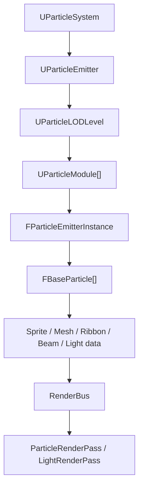

# Particle Module User Guide

작성일: 2026-05-26

## 목적

이 문서는 현재 엔진의 Particle Module을 팀원이 바로 조합해서 테스트할 수 있도록 정리한다.
세부 구현 설명보다 "어떤 효과를 만들 때 어떤 모듈을 쓰는가"에 초점을 둔다.

## 기본 흐름

Particle asset은 emitter와 module 목록을 가진다. Runtime에서는 `FParticleEmitterInstance`가 `FBaseParticle` 배열을 갱신하고, render 단계에서 particle data를 각 렌더 타입에 맞는 데이터로 변환한다.

## 기본 Module

| Module | 역할 | 자주 쓰는 효과 |
| --- | --- | --- |
| `UParticleModuleRequired` | 기본 particle 값, material, SubUV grid, emitter type 기준 | 모든 emitter |
| `UParticleModuleSpawn` | 초당 spawn 개수 계산 | 지속 화염, 연기, 비 |
| `UParticleModuleBurst` | 특정 시간에 여러 particle을 한 번에 spawn | 폭발, 총구 화염, 충격파 |
| `UParticleModuleLifetime` | particle 생존 시간 | 모든 emitter |
| `UParticleModuleLocation` | min/max box 범위 위치 spawn | 단순 분산 spawn |
| `UParticleModuleLocationShape` | Sphere / Box / Cone shape spawn | 폭발 구체, 원뿔 분사, 영역 spawn |
| `UParticleModuleVelocity` | 초기 속도 | 불꽃 상승, 분사 방향 |
| `UParticleModuleAcceleration` | 매 frame 가속도 | 중력, 바람 |
| `UParticleModuleDrag` | 속도 감쇠 | 연기, 먼지, 마찰감 |
| `UParticleModuleRotationRate` | sprite 회전 | 불꽃, 마법 파편 |
| `UParticleModuleColor` | 수명 기반 color fade | fade out, 색 변화 |
| `UParticleModuleSize` | 수명 기반 size 변화 | 커지는 연기, 작아지는 spark |
| `USubUVModule` | flipbook frame 선택 | 폭발 애니메이션, 불꽃 flipbook |
| `UParticleModuleLight` | particle 위치에 point light render data 생성 | 불꽃, 에너지 구체 |
| `UParticleModuleCollision` | world trace/sweep 기반 충돌 | 바닥 튕김, 충돌 시 제거 |
| `UParticleModuleEventGenerator` | collision event dispatch 및 throttling | 충돌 이벤트 연동 |

## Render TypeData

| TypeData | 역할 | 주의 |
| --- | --- | --- |
| `USpriteTypeData` | 기본 billboard sprite render | 가장 안정적인 기본값 |
| `UMeshTypeData` | particle마다 mesh instance render | mesh/material 설정 필요 |
| `UBeamTypeData` | source-target strip render | source/target fallback 확인 필요 |
| `URibbonTypeData` | particle chain을 trail strip으로 render | smoke test 필요 |

## 추천 조합

### Fire / Spark

- Required
- Spawn
- Burst
- Lifetime
- LocationShape: Cone 또는 Sphere
- Velocity
- Acceleration
- Drag
- Color
- Size
- RotationRate
- SubUV
- Light

### Smoke

- Required
- Spawn
- Lifetime
- LocationShape: Box 또는 Sphere
- Velocity
- Acceleration
- Drag
- Color
- Size
- RotationRate

### Ground Bounce Particle

- Required
- Spawn 또는 Burst
- Lifetime
- LocationShape
- Velocity
- Acceleration
- Collision
- EventGenerator

### Trail / Slash

- Required
- Spawn
- Lifetime
- Location / Velocity
- Size / Color
- Ribbon TypeData

## Smoke Test Checklist

### 공통

- Particle System asset 생성 후 `UParticleSystemComponent.Template`에 표시되는지 확인한다.
- Add Module 메뉴에서 새 모듈이 보이는지 확인한다.
- property 변경 후 에디터가 crash 없이 반영되는지 확인한다.
- Debug 빌드에서 실행한다.

### Shape Location

- Sphere / Box / Cone이 각각 다른 spawn 분포를 보이는지 확인한다.
- Surface Only를 켰을 때 표면 위주로 생성되는지 확인한다.

### Light

- Light 모듈을 추가하고 Brightness / Radius를 올렸을 때 주변 조명이 바뀌는지 확인한다.
- Max Lights Per Emitter를 낮췄을 때 성능/밝기 변화가 있는지 확인한다.
- Shadow는 현재 particle light에서 의도적으로 제외한다.

### SubUV

- Life 모드에서 lifetime 동안 Start-End frame이 진행되는지 확인한다.
- FPS 모드에서 Frame Rate 값에 따라 재생 속도가 바뀌는지 확인한다.
- Loop / Random Start Frame이 눈에 보이는지 확인한다.

### Collision / Event

- Point와 Sphere trace mode가 모두 충돌하는지 확인한다.
- Restitution / Friction이 bounce에 반영되는지 확인한다.
- Max Collision Events Per Frame을 낮췄을 때 이벤트 폭주가 제한되는지 확인한다.

### Ribbon

- Ribbon TypeData를 적용한 emitter가 trail strip을 그리는지 확인한다.
- Max Particle In Trail 값을 낮추면 trail 길이가 줄어드는지 확인한다.
- Material을 지정했을 때 texture/color가 정상 반영되는지 확인한다.

## 현재 보류한 것

- Spawn / Death event payload는 별도 이벤트 큐 설계가 필요해서 이번 범위에서는 제외했다.
- Particle light shadow는 light capacity와 shadow atlas 비용이 커서 제외했다.
- Ribbon view-facing side vector는 현재 world-up 기반이다. 카메라 facing ribbon은 후속 작업으로 남긴다.
- ReplayData 구조는 B 담당 렌더링 구조와 충돌할 수 있어 직접 변경하지 않았다.
