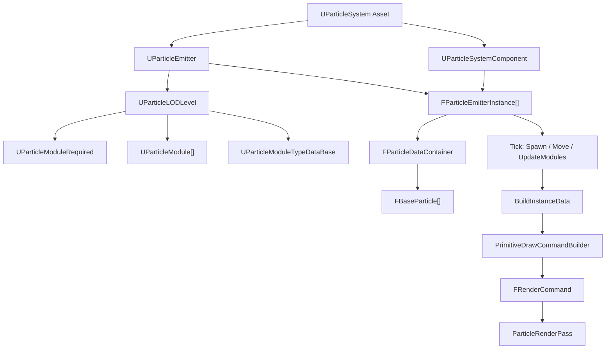
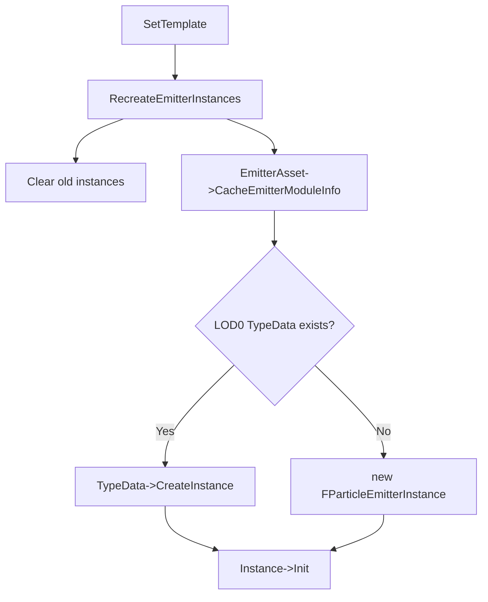
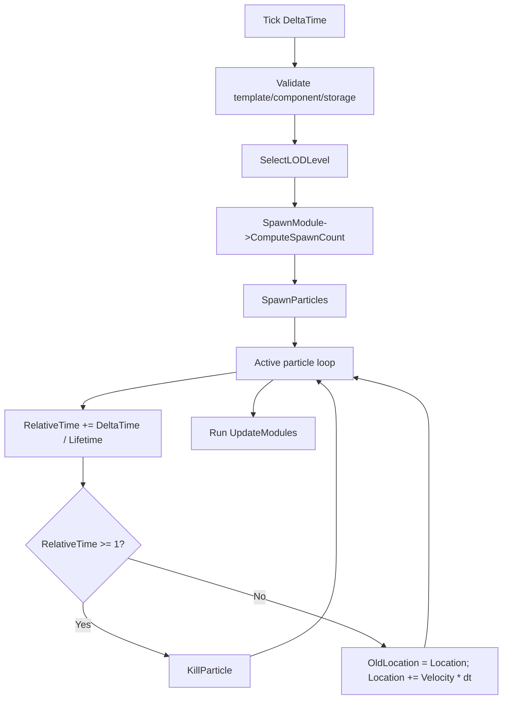
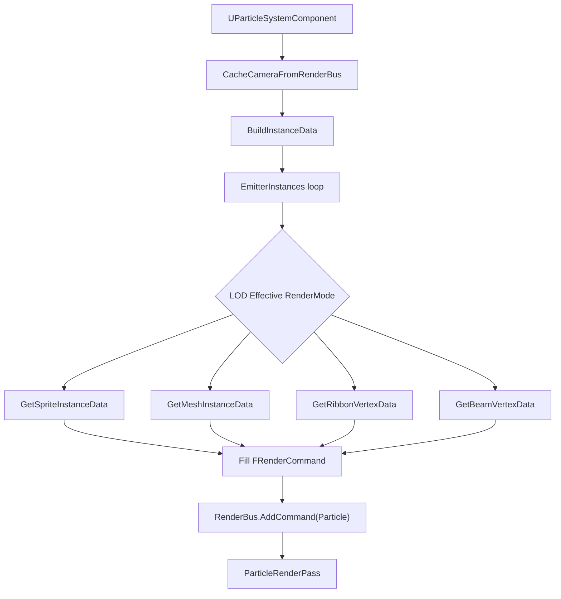
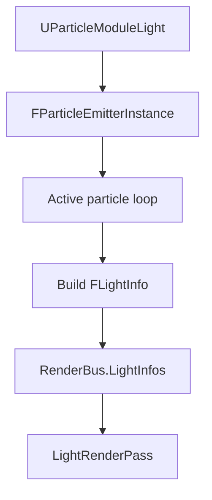
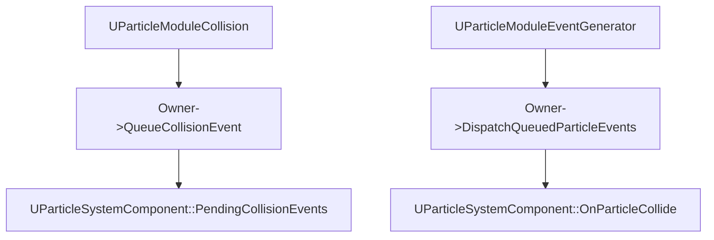

# Particle Runtime Flow

> 목적: 팀원이 Particle asset, module, runtime instance, render data의 관계를 빠르게 이해할 수 있게 현재 엔진 구조를 정리한다.
> 작성일: 2026-05-26

## 1. 한 줄 요약

Particle asset은 emitter/module 구성을 가진 설계도이고, `UParticleSystemComponent`가 runtime instance를 만들며, `FParticleEmitterInstance`가 active particle을 CPU에서 갱신한 뒤 render 단계에서 Sprite/Mesh/Ribbon/Beam 데이터로 변환한다.

## 2. 전체 흐름



## 3. Asset 계층

### `UParticleSystem`

- 여러 `UParticleEmitter`를 가진다.
- `CacheEmitterModuleInfo()`를 통해 각 emitter의 module cache를 갱신한다.

### `UParticleEmitter`

- 여러 `UParticleLODLevel`을 가진다.
- `SelectLODLevel(Distance)`로 현재 거리에서 쓸 LOD index를 고른다.
- `CacheEmitterModuleInfo()`에서 `ParticleSize`, `MaxActiveParticles`, LOD cache를 갱신한다.

### `UParticleLODLevel`

- `RequiredModule`은 별도 포인터로 가진다.
- 일반 module은 `Modules` 배열에 들어간다.
- cache 결과로 아래 포인터/배열을 가진다.

```cpp
UParticleModuleSpawn* SpawnModule;
TArray<UParticleModule*> SpawnModules;
TArray<UParticleModule*> UpdateModules;
UParticleModuleTypeDataBase* TypeDataModule;
```

중요한 규칙:

- `TypeDataModule`은 실행 module이 아니라 emitter runtime/render policy다.
- `UParticleModuleSpawn`은 spawn count 계산용 특수 module로 잡힌다.
- `IsSpawnModule()`이 true인 module은 particle 생성 직후 실행된다.
- `IsUpdateModule()`이 true인 module은 particle 이동 후 실행된다.

## 4. Runtime 생성

`UParticleSystemComponent::SetTemplate()` 또는 property 변경 후 `RecreateEmitterInstances()`가 호출된다.



TypeData별 instance:

| TypeData | Runtime instance |
| --- | --- |
| Sprite | `FParticleEmitterInstance` |
| Mesh | `FParticleMeshEmitterInstance` |
| Ribbon | `FParticleRibbonEmitterInstance` |
| Beam | `FParticleBeamEmitterInstance` |

## 5. Particle memory

`FParticleDataContainer`가 particle data와 active index를 한 block 안에 배치한다.

```text
ParticleData block:
[Slot 0][Slot 1][Slot 2] ... [Slot N]

ParticleIndices:
[active slot index 0][active slot index 1] ...
```

핵심:

- active particle은 `ParticleIndices[0..ActiveParticles-1]`로 접근한다.
- `KillParticle()`은 active index를 마지막 active index와 swap-pop한다.
- payload가 있으면 `FBaseParticle` 뒤에 붙는 구조로 stride가 커진다.
- 현재 stride source-of-truth는 `FParticleDataContainer::GetStride()`다.

주의:

- active index와 slot index를 혼동하면 Ribbon chain, Mesh payload, Collision event가 깨질 수 있다.

## 6. Tick 순서

현재 `FParticleEmitterInstance::Tick()`의 흐름:



실행 순서상 중요한 점:

1. Spawn module은 새 particle 생성 직후 실행된다.
2. 기본 위치 적분은 update module보다 먼저 수행된다.
3. Collision module은 update module이므로 `OldLocation -> Location` 이동 구간을 검사할 수 있다.
4. EventGenerator도 update module이므로 module 배열 순서에 따라 dispatch timing이 달라질 수 있다.

## 7. Spawn 순서

`SpawnParticles()`는 새 active slot을 만들고 spawn module을 순회한다.

```text
1. ActiveIndex = ActiveParticles
2. SlotIndex = ParticleIndices[ActiveIndex]
3. Slot memory에 FBaseParticle 기본값 작성
4. ParticleId 증가
5. Location / OldLocation / Velocity 기본값 설정
6. CurrentLODLevel->GetSpawnModules() 순회
7. ActiveParticles 증가
```

새 module이 spawn 초기값을 바꾸려면 `bSpawnModule = true`로 두고 `Spawn()`을 구현한다.

## 8. Update 순서

새 module이 매 frame particle 상태를 바꾸려면 `bUpdateModule = true`로 두고 `Update()`를 구현한다.

대표 예시:

| Module | Update에서 하는 일 |
| --- | --- |
| Color | lifetime 기반 color interpolation |
| Size | lifetime 기반 size interpolation |
| Collision | world trace/sweep 후 response 적용 |
| EventGenerator | queued event dispatch |
| SubUV | lifetime 기반 frame index 계산 |

주의:

- `KillParticle()` 호출 후에는 같은 index에 다른 particle이 swap되어 들어올 수 있으므로 loop index 증가를 조심해야 한다.
- Collision처럼 kill 가능성이 있는 module은 `for (int32 i = 0; i < Count;)` 패턴이 필요하다.

## 9. Render data 흐름

Render collection에서 particle component가 보이면 `PrimitiveDrawCommandBuilder`가 아래 순서로 처리한다.



RenderMode별 데이터:

| RenderMode | Getter | Command field |
| --- | --- | --- |
| Sprite | `GetSpriteInstanceData` | `Cmd.ParticleInstances` |
| Mesh | `GetMeshInstanceData` | `Cmd.MeshParticleInstances` |
| Ribbon | `GetRibbonVertexData` | `Cmd.RibbonVertices` |
| Beam | `GetBeamVertexData` | `Cmd.BeamVertices` |

중요한 경계:

- `FParticleEmitterInstance`는 render command를 몰라야 한다.
- instance는 자기 buffer를 만들고 getter로 노출한다.
- `PrimitiveDrawCommandBuilder`가 instance data를 `FRenderCommand`로 매핑한다.

## 10. Light Module 예정 흐름

Particle Light는 particle render command가 아니라 renderer의 light array로 가는 것이 자연스럽다.



1차 정책:

- particle마다 `UPointLightComponent`를 생성하지 않는다.
- shadow는 지원하지 않는다.
- `SpawnFraction`, `MaxLightsPerEmitter`로 개수를 제한한다.
- `RenderBus.LightInfos` capacity를 넘지 않게 방어한다.

ReplayData 담당자와 맞출 계약:

```cpp
struct FParticleLightRenderData
{
    FVector Position;
    FVector Color;
    float Intensity;
    float Radius;
    float Falloff;
};
```

## 11. Event 흐름

현재 collision event 흐름:



향후 확장:

- Spawn event
- Death event
- Collision event 통합 event queue

주의:

- event를 즉시 호출하면 module 순서와 particle kill timing이 꼬일 수 있다.
- queue에 쌓고 정해진 시점에 dispatch하는 편이 안전하다.

## 12. Module 추가 체크리스트

새 module 추가 시 확인할 것:

- [ ] `UParticleModule` 파생 class 생성
- [ ] constructor에서 `bSpawnModule` 또는 `bUpdateModule` 설정
- [ ] 필요한 property에 `UPROPERTY` 지정
- [ ] editor add menu에 노출되는지 확인
- [ ] asset 저장/로드 확인
- [ ] `CacheModuleLists()`에서 원하는 실행 목록에 들어가는지 확인
- [ ] kill 가능 module이면 swap-pop loop 안정성 확인
- [ ] render data가 필요하면 instance buffer 또는 RenderBus 계약을 명확히 정리

## 13. Utils / Helpers 작성 규칙

Particle 런타임 코드는 `Utils`를 기본 명명으로 사용한다.

- 순수 계산/샘플링/변환 함수: `Particle*Utils`
- 에디터 워크플로우 보조 클래스: `FEditor*Helpers`
- 신규 `Util` 단수형 명명은 사용하지 않는다.
- 기존 공용 API인 `MathUtil`은 예외로 유지한다.

요청 사항:

- anonymous namespace 사용을 지양한다.

권장 방식:

```cpp
class UParticleModuleLight : public UParticleModule
{
private:
    static float ComputeLightRadius(const FBaseParticle& Particle, float RadiusScale);
};
```

또는:

```cpp
namespace ParticleLightUtils
{
    float ComputeLightRadius(const FBaseParticle& Particle, float RadiusScale);
}
```

기준:

- class와 강하게 묶인 helper는 `private static` 멤버로 둔다.
- 여러 파일에서 공유할 가능성이 있으면 명명된 namespace와 header를 둔다.
- 한 파일 안에서만 쓰더라도 anonymous namespace로 숨기지 않는다.

## 14. 팀원별 경계

| 담당 영역 | 건드리는 파일 | 합의가 필요한 경우 |
| --- | --- | --- |
| Module | `ParticleModules.*`, 신규 module 파일 | `FBaseParticle` 필드 추가, payload 추가 |
| Core Runtime | `ParticleEmitterInstance.*`, `ParticleTypes.h` | stride, active index, kill 방식 변경 |
| Rendering / ReplayData | `Particle*EmitterInstance.*`, `RenderCommand.h`, render pass | render data 구조 변경 |
| Light | `RenderBus.h`, `LightRenderCollector.cpp`, `PrimitiveDrawCommandBuilder.cpp` | shadow, light capacity, pass 변경 |
| Editor | particle editor widget, property UI | module add menu, property category 변경 |

## 15. Batch 0 완료 기준

- 현재 asset/runtime/render/event 흐름이 문서화되어 있다.
- anonymous namespace 지양 규칙이 문서화되어 있다.
- Batch 1에서 추가할 기본 물리 모듈의 위치와 실행 순서가 명확하다.
