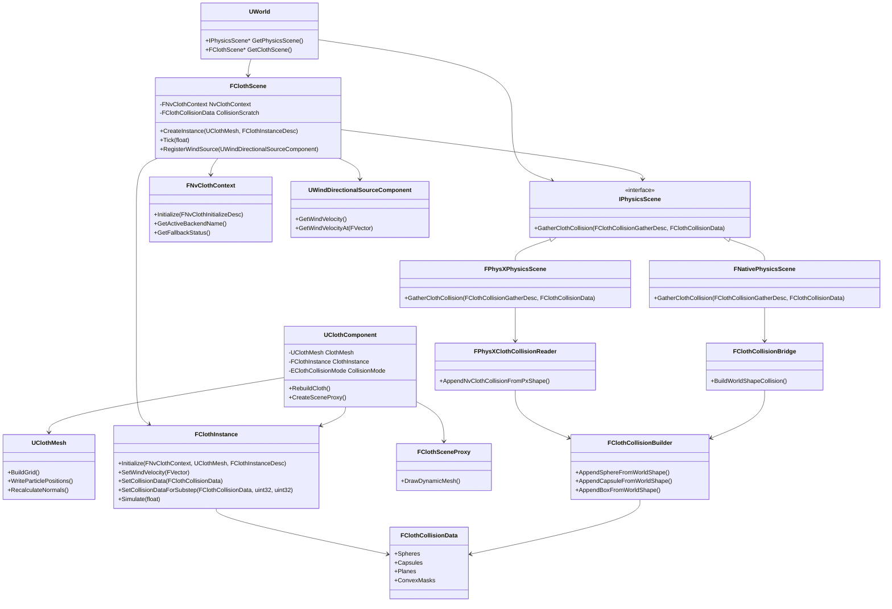

# NvCloth Integration Plan

## Goal

Integrate NvCloth 1.1.6 into the engine as a real engine subsystem, not as a sample-only feature.

The first visible feature will be procedural cloth, wind, material rendering, double-sided rendering, and runtime-shape collision. The structure must still be able to grow later without rewriting the core integration.

## Design Rules

- Keep the engine-facing classes clear and small.
- Avoid namespace wrappers for new engine code unless an existing local pattern requires one.
- Do not make `UClothComponent` depend directly on PhysX types.
- Do not compile the whole NvCloth source tree as engine source.
- Treat NvCloth like PhysX: ThirdParty include/lib/bin, engine-side wrapper, and explicit build-system integration.
- Use the physics backend's runtime shapes as the authoritative collision source.
- Do not parse PhysicsAsset authoring data directly from cloth code; PhysicsAsset bodies are included only after the physics scene has instantiated them as runtime shapes.
- Prefer world-owned systems over global singletons for runtime simulation.
- Keep generated project-file support as the source of truth for `.vcxproj` updates.

## Final Runtime Shape

```text
UWorld
 |-- IPhysicsScene
 |-- FScene
 `-- FClothScene
      |-- FNvClothContext
      |-- IPhysicsScene::GatherClothCollision
      |-- ClothComponents
      `-- WindSources
```

```text
AClothActor
 `-- UClothComponent
      |-- UClothMesh
      |-- FClothInstance
      `-- FClothSceneProxy
```

## Class Responsibilities

| Class | Responsibility |
| --- | --- |
| `FClothScene` | World-owned cloth subsystem. Registers cloth components and wind sources, owns cloth tick orchestration, gathers simulation inputs, and drives all cloth instances. |
| `FNvClothContext` | Owns NvCloth backend setup, factory creation, allocator/error callbacks, and CUDA/DX11/CPU fallback selection. |
| `FClothCollisionBridge` | Native/world-component fallback that converts engine shape components into cloth collision primitives when no physics-scene gather path is available. |
| `FClothCollisionBuilder` | Shared primitive converter. Writes world-space sphere/capsule/box input into NvCloth-compatible local-space spheres, capsule index pairs, planes, and convex masks. |
| `FClothCollisionData` | Engine-owned collision payload passed into `FClothInstance`; contains only NvCloth-compatible primitive arrays, not PhysX objects. |
| `FPhysXClothCollisionReader` | PhysX backend reader. Reads existing `PxShape`/`PxRigidActor` runtime shapes and appends equivalent cloth collision primitives through `FClothCollisionBuilder`. It does not create PhysX collision. |
| `IPhysicsScene::GatherClothCollision` | Backend-owned cloth collision gather entry point. PhysX gathers from actual PhysX runtime shapes; Native falls back to world shape components. |
| `UClothComponent` | User-facing primitive component. Owns cloth settings, material assignment, pin mode, collision mode, and the runtime mesh/instance pair. |
| `UClothMesh` | Procedural cloth mesh data. Builds grid vertices, indices, particles, inverse masses, UVs, and normals. Updates render vertices from simulation output. |
| `FClothInstance` | NvCloth runtime object wrapper. Owns fabric, cloth, solver membership, and simulation state. |
| `FClothSceneProxy` | Render-thread-facing dynamic mesh proxy. Uploads cloth vertices/indices and resolves material/double-sided draw behavior. |
| `AClothActor` | Convenience actor containing a `UClothComponent`. |
| `UWindDirectionalSourceComponent` | World wind source. Registers with `FClothScene` and exposes direction, strength, radius, and falloff parameters. |
| `FClothStats` / `FClothViewportStats` | Runtime and overlay-facing cloth statistics. Reports active backend, fallback result, cloth count, particle count, collision count, wind source count, and simulation timing. |

## Included Scope

- NvCloth 1.1.6 ThirdParty import.
- VS2022 and VS2026 project generation support.
- CPU backend.
- CUDA backend if present, with DX11 fallback, then CPU fallback.
- Procedural rectangular cloth grid.
  - Default component size is `7 x 7` engine units/meters, not the original sample-scale `300 x 300`.
- Pin modes for rectangular procedural cloth:
  - `None`
  - `TopRow`
  - `Corners` / `TopCorners`
  - `BottomRow`
  - `LeftColumn`
  - `RightColumn`
  - `FourCorners`
  - `Edges`
  - `GoalFrame` (`TopRow + LeftColumn + RightColumn`)
- Material assignment through the normal primitive/material path.
- Double-sided rendering.
- Directional wind.
  - `Radius <= 0` means global wind.
  - `Radius > 0` applies distance falloff from the wind source location.
  - `AWindDirectionalSourceActor` uses an editor billboard backed by `Content/Editor/Icons/S_WindDirectional.PNG`.
- Component-exposed cloth stability settings:
  - damping
  - linear drag
  - angular drag
  - air drag/lift coefficients
  - collision friction
  - collision mass scale
  - collision thickness
  - continuous collision toggle
- Collision against physics-scene runtime shapes:
  - `USphereComponent`
  - `UCapsuleComponent`
  - `UBoxComponent`
  - PhysicsAsset bodies only when they have already been instantiated into the PhysX scene as runtime sphere/capsule/box shapes.
- `stat cloth` overlay showing active simulation backend and cloth runtime counters.

## Explicitly Excluded

- Direct PhysicsAsset authoring-data parsing from cloth code.
- SkeletalMesh material-section cloth.
- StaticMesh cloth authoring.
- Cloth asset serialization.
- Cloth painting.
- Cloth LOD.
- Self-collision polish beyond basic NvCloth settings.
- Editor tooling beyond enough placement/property support to test the feature.

## Current Runtime Flow

The current implementation is engine-subsystem shaped rather than sample shaped:

```text
UWorld::InitWorld
  -> creates FClothScene
  -> FClothScene initializes FNvClothContext
       -> tries CUDA
       -> falls back to DX11
       -> falls back to CPU

UClothComponent::BeginPlay / rebuild
  -> owns or rebuilds UClothMesh
  -> asks FClothScene to create FClothInstance
  -> FClothInstance cooks fabric and creates NvCloth cloth/solver objects

UWorld::Tick
  -> physics scene tick
  -> actor/component update
  -> FClothScene::Tick
       -> compute wind from WindDirectionalSource components at each cloth component origin
       -> gather collision through IPhysicsScene::GatherClothCollision
       -> push gravity/wind/collision into FClothInstance
       -> simulate NvCloth
       -> write particles back into UClothMesh
       -> mark component bounds/render data dirty
  -> camera/update/render
```

## Collision Runtime Flow

Important rule: NvCloth does not consume a PhysX scene pointer. The engine translates runtime collision shapes into NvCloth's own collision arrays every cloth tick.

```text
FClothScene::Tick
  -> IPhysicsScene::GatherClothCollision(desc, outData)
       desc.CollisionThickness comes from UClothComponent
  -> split the frame into fixed cloth substeps
  -> pass interpolated collision start/target data to FClothInstance per substep

PhysX backend:
  FPhysXPhysicsScene
    -> registered primitive BodyInstance actors
    -> instantiated SkeletalMesh PhysicsAsset body actors
    -> PxShape filtering
         - simulation shapes only
         - skip the cloth component itself
         - skip disabled owner components
    -> FPhysXClothCollisionReader
    -> FClothCollisionBuilder
    -> FClothCollisionData

Native fallback:
  FNativePhysicsScene
    -> FClothCollisionBridge
    -> world shape components
    -> FClothCollisionBuilder
    -> FClothCollisionData

FClothInstance::SetCollisionDataForSubstep
  -> compare this frame's collision topology with the previous frame
  -> build substep-local start/target sphere and plane updates when compatible
  -> set capsule indices and convex masks for the current collision topology
```

Collision is currently one-way: engine/PhysX shapes affect cloth, but cloth does not push rigid bodies back.

Collision thickness is an engine-side stability margin. `FClothCollisionBuilder` inflates sphere/capsule radii and box extents before converting them to NvCloth local-space collision primitives. This helps reduce deep initial penetration and violent correction when a moving capsule or box contacts the cloth.

Moving collision uses `FClothInstance`'s previous collision snapshot as the NvCloth start state and the current gathered snapshot as the target state. `FClothScene` uses a PhysX-aligned `1/60` maximum cloth substep, and `FClothInstance::SetCollisionDataForSubstep` feeds each substep a smaller collision sweep segment. The previous snapshot is used only when sphere/capsule topology or plane/convex topology still matches and the cloth component world transform is unchanged. If topology changes, or the cloth actor itself moved, the instance falls back to current-only collision for that frame to avoid an invalid sweep.

## Class Diagram



## Tick Order Target

The target tick order is:

```text
1. PhysicsScene Tick
2. Actor / Component Tick
3. ClothScene Tick
4. PlayerCamera Tick
5. Render
```

`FClothScene` should tick after normal component updates so wind source transforms, player capsule transforms, and other actor state are current before cloth simulation.

## NvCloth ThirdParty Layout

Target layout:

```text
KraftonEngine/ThirdParty/NvCloth
 |-- include
 |   `-- NvCloth
 |-- lib
 |   `-- win.x86_64.vc141.cuda10.md
 |       |-- debug
 |       `-- release
 |-- bin
 |   `-- win.x86_64.vc141.cuda10.md
 |       |-- debug
 |       `-- release
 `-- source
     `-- optional browse-only source, not compiled by the engine project
```

Expected project variables:

```xml
<NvClothRoot>$(ProjectDir)ThirdParty\NvCloth\</NvClothRoot>
<NvClothIncludeDirectories>$(NvClothRoot)include</NvClothIncludeDirectories>
<NvClothLibDir>$(NvClothRoot)lib\win.x86_64.vc141.cuda10.md\$(NvClothBuildConfig)</NvClothLibDir>
<NvClothBinDir>$(NvClothRoot)bin\win.x86_64.vc141.cuda10.md\$(NvClothBuildConfig)</NvClothBinDir>
```

The engine should link NvCloth import/static libraries and copy required NvCloth DLLs into `$(OutDir)` in the existing post-build copy style.

## CUDA 10.0 NvCloth Rebuild Notes

The current checked-in NvCloth binaries were rebuilt for CUDA Toolkit 10.0 and the VS2017 v141 toolset, then copied into the engine ThirdParty folder. The folder name is intentionally `win.x86_64.vc141.cuda10.md` so the binary ABI/toolchain target is visible instead of implying a vc143 build.

The CUDA 10.0 build also includes a `compute_60` PTX fallback in addition to NvCloth's default CUDA 10 SASS targets (`sm_30`, `sm_35`, `sm_50`, `sm_60`). This matters for newer GPUs such as RTX 40-series: CUDA 10.0 cannot emit native `sm_89` code, but a current NVIDIA driver may JIT the embedded PTX instead of failing with `CUDA_ERROR_NO_BINARY_FOR_GPU`.

Local tool versions used:

```text
CUDA Toolkit: C:\Program Files\NVIDIA GPU Computing Toolkit\CUDA\v10.0
nvcc: release 10.0, V10.0.130
MSVC v141: C:\Program Files\Microsoft Visual Studio\2022\Community\VC\Tools\MSVC\14.16.27023
Generator: Visual Studio 17 2022, x64, toolset v141
External NvCloth workspace: C:\Users\jungle\Desktop\YG\Week13\NvCloth
```

Configure NvCloth from a clean build directory with CUDA paths written using forward slashes:

```powershell
$env:GW_DEPS_ROOT = "C:/Users/jungle/Desktop/YG/Week13/NvCloth/"
& "C:\Program Files\Microsoft Visual Studio\18\Community\Common7\IDE\CommonExtensions\Microsoft\CMake\CMake\bin\cmake.exe" `
  -S "C:/Users/jungle/Desktop/YG/Week13/NvCloth" `
  -B "_nvcloth_cuda10_v141_build" `
  -G "Visual Studio 17 2022" `
  -A x64 `
  -T v141 `
  -DCMAKE_GENERATOR_INSTANCE="C:/Program Files/Microsoft Visual Studio/2022/Community,version=17.14.37027.9" `
  -DCUDA_TOOLKIT_ROOT_DIR="C:/Program Files/NVIDIA GPU Computing Toolkit/CUDA/v10.0" `
  -DCUDA_SDK_ROOT_DIR="C:/Program Files/NVIDIA GPU Computing Toolkit/CUDA/v10.0" `
  "-DCUDA_NVCC_FLAGS=-gencode;arch=compute_60,code=compute_60" `
  -DPX_OUTPUT_DLL_DIR="out/bin" `
  -DPX_OUTPUT_LIB_DIR="out/lib"
```

Build Release and Debug from a v141 developer environment. This is important because plain MSBuild can otherwise pick up newer VS2022 headers, which CUDA 10.0 cannot compile.

```powershell
& cmd.exe /s /c "`"C:\Program Files\Microsoft Visual Studio\2022\Community\VC\Auxiliary\Build\vcvars64.bat`" -vcvars_ver=14.16 && set `"GW_DEPS_ROOT=C:/Users/jungle/Desktop/YG/Week13/NvCloth/`" && set `"CUDA_PATH=C:/Program Files/NVIDIA GPU Computing Toolkit/CUDA/v10.0`" && set `"CUDA_PATH_V10_0=C:/Program Files/NVIDIA GPU Computing Toolkit/CUDA/v10.0`" && `"C:\Program Files\Microsoft Visual Studio\2022\Community\MSBuild\Current\Bin\amd64\MSBuild.exe`" `"_nvcloth_cuda10_v141_build\NvCloth.vcxproj`" /p:Configuration=release /p:Platform=x64 /p:VCToolsVersion=14.16.27023 /m"
& cmd.exe /s /c "`"C:\Program Files\Microsoft Visual Studio\2022\Community\VC\Auxiliary\Build\vcvars64.bat`" -vcvars_ver=14.16 && set `"GW_DEPS_ROOT=C:/Users/jungle/Desktop/YG/Week13/NvCloth/`" && set `"CUDA_PATH=C:/Program Files/NVIDIA GPU Computing Toolkit/CUDA/v10.0`" && set `"CUDA_PATH_V10_0=C:/Program Files/NVIDIA GPU Computing Toolkit/CUDA/v10.0`" && `"C:\Program Files\Microsoft Visual Studio\2022\Community\MSBuild\Current\Bin\amd64\MSBuild.exe`" `"_nvcloth_cuda10_v141_build\NvCloth.vcxproj`" /p:Configuration=debug /p:Platform=x64 /p:VCToolsVersion=14.16.27023 /m"
```

Copy the resulting files into the engine:

```text
_nvcloth_cuda10_v141_build/out/bin/NvCloth_x64.dll
  -> KraftonEngine/ThirdParty/NvCloth/bin/win.x86_64.vc141.cuda10.md/release/NvCloth_x64.dll
_nvcloth_cuda10_v141_build/out/bin/NvClothDEBUG_x64.dll
  -> KraftonEngine/ThirdParty/NvCloth/bin/win.x86_64.vc141.cuda10.md/debug/NvClothDEBUG_x64.dll
_nvcloth_cuda10_v141_build/out/lib/NvCloth_x64.lib
  -> KraftonEngine/ThirdParty/NvCloth/lib/win.x86_64.vc141.cuda10.md/release/NvCloth_x64.lib
_nvcloth_cuda10_v141_build/out/lib/NvClothDEBUG_x64.lib
  -> KraftonEngine/ThirdParty/NvCloth/lib/win.x86_64.vc141.cuda10.md/debug/NvClothDEBUG_x64.lib
```

Verification performed:

- `cuobjdump --dump-ptx` on the generated `cuda_compile_fatbin_1_generated_CuSolverKernel.cu.fatbin` showed embedded PTX with `.target sm_60`.
- `dumpbin /DEPENDENTS` on `NvCloth_x64.dll` showed `nvcuda.dll` as delay-loaded and no `cudart64_*.dll` direct dependency.
- `dumpbin /EXPORTS` showed CUDA/DX/CPU factory exports including `NvClothCreateFactoryCUDA`.
- Engine `Debug|x64` and `Release|x64` builds passed after switching the project paths to `win.x86_64.vc141.cuda10.md`; only the pre-existing PhysX PDB `LNK4099` warnings remained.

Compatibility guarantee: these binaries are built against CUDA Toolkit 10.0, so they are the correct target for a CUDA 10.0-era demo machine. Runtime success still depends on the installed NVIDIA driver and GPU supporting the CUDA path that NvCloth uses. On newer GPUs, the included PTX fallback may allow the driver to JIT the CUDA kernels, but this is still a runtime driver/GPU capability check rather than an absolute guarantee. The engine must keep the existing CUDA -> DX11 -> CPU fallback path as the actual safety net for machines where CUDA factory creation fails.

## Integration Strategy

NvCloth integration is split into two distinct layers.

Layer 1: ThirdParty binary integration.

```text
External NvCloth build output
        |
        v
KraftonEngine/ThirdParty/NvCloth/include/lib/bin
        |
        v
GenerateProjectFiles.py include/lib/bin configuration
```

Layer 2: Engine wrapper integration.

```text
ThirdParty/NvCloth
        |
        v
FNvClothContext
        |
        v
FClothInstance
        |
        v
FClothScene
        |
        v
UClothComponent / UClothMesh / FClothSceneProxy
```

Batch 0 and Batch 1 only make NvCloth available to the engine build. They do not expose NvCloth directly to gameplay or component code.

Batch 2 starts the engine-owned wrapper boundary. From that point forward, engine code should talk to `FNvClothContext`, `FClothInstance`, and cloth-owned types rather than directly spreading NvCloth API calls across components.

This is intentional:

- ThirdParty code remains replaceable and isolated.
- `UClothComponent` stays an engine component, not an NvCloth API surface.
- Native NvCloth pointers stay inside `.cpp` files or narrow runtime wrappers where possible.
- Future CUDA/DX11/CPU fallback changes stay in `FNvClothContext`.
- Future simulation policy changes stay in `FClothScene` and `FClothInstance`.

## Build And Platform Policy

NvCloth integration is x64-first.

The current engine project still has Win32 configurations, but the existing PhysX/NvCloth runtime target is the x64 path. NvCloth should therefore be guarded by build defines instead of assuming every platform/configuration can link it.

Required build defines:

```text
WITH_NVCLOTH=1    for x64 configurations when ThirdParty NvCloth files are present
WITH_NVCLOTH=0    for Win32 configurations or missing dependency configurations
```

Rules:

- x64 `Debug`, `Release`, `Game`, `Demo`, and `ObjViewDebug` may enable NvCloth.
- Win32 configurations should compile without NvCloth runtime code by using `WITH_NVCLOTH=0`.
- Public component headers must compile even when `WITH_NVCLOTH=0`.
- Engine behavior with `WITH_NVCLOTH=0` should be a clean disabled state, not a link error.

## Backend Policy

Backend selection should be explicit but default to automatic.

```cpp
enum class EClothBackendPreference
{
    Auto,
    CUDA,
    DX11,
    CPU
};

enum class EClothBackend
{
    None,
    CUDA,
    DX11,
    CPU
};
```

Default preference:

```text
Auto: CUDA -> DX11 -> CPU
```

Manual preference behavior:

```text
CUDA: try CUDA, then DX11, then CPU unless strict mode is added later
DX11: try DX11, then CPU
CPU: use CPU only
```

The initial project setting can live in `FProjectSettings` as a global cloth option. Per-component backend override is not needed now.

DX11 backend note:

- DX11 fallback is not just a library check. It needs access to the engine's D3D11 device/context through the renderer/device layer.
- `FNvClothContext` should accept an optional D3D device handle during initialization or expose a late `InitializeDx11(...)` path.
- If D3D is unavailable, headless, or the DX11 factory fails, the context should continue to CPU.

CUDA backend note:

- The engine should not require CUDA Toolkit on every runtime machine.
- Runtime machines need a compatible NVIDIA display driver for CUDA execution.
- If the CUDA driver/runtime path fails, fallback should continue to DX11 and then CPU.
- `stat cloth` should show the active backend and the fallback chain that occurred.

## Runtime Dependency Policy

Batch 0 must distinguish build-time and runtime dependencies.

Build-time:

- NvCloth public headers.
- NvCloth `.lib` files.
- PhysX `pxshared` headers already available through the existing PhysX integration.

Runtime:

- NvCloth DLLs copied into `$(OutDir)`.
- Any CUDA/DX11-specific NvCloth runtime DLLs produced by the selected NvCloth build.

The engine should not copy NvCloth sample DLLs such as DXUT, DirectXTex, HBAO, ShadowLib, or SampleBase dependencies unless a specific NvCloth runtime binary actually depends on them. If a dependency is uncertain, verify with `dumpbin /DEPENDENTS` before copying it into the engine.

## Simulation Policy

The first implementation can run cloth on the game thread, inside `FClothScene::Tick`.

Initial rules:

- Split the world delta time into PhysX-aligned `1/60` second maximum cloth substeps, capped at 4 substeps per frame.
- Clamp large PIE/editor frame spikes to the maximum substep window instead of feeding an unbounded delta into NvCloth.
- Gather collision once per cloth per frame, then interpolate compatible collision shapes across the substeps.
- Keep solver count simple at first, likely one solver per active backend/world.
- Keep all NvCloth object creation/destruction on the same owning thread until threading is deliberately introduced.
- Do not add a job system dependency in the first pass.

Current default stability values:

| Setting | Default | Range | Reason |
| --- | ---: | ---: | --- |
| `SolverFrequency` | `120.0` | `>= 1.0` | Keep solver iteration density stable without immediately increasing cost. |
| `StiffnessFrequency` | `60.0` | `>= 1.0` | Keep fabric stiffness predictable. |
| `Damping` | `0.35` | `0.0 - 1.0` | Dampen particle velocity after collision correction. |
| `LinearDrag` | `0.20` | `0.0 - 1.0` | Reduce runaway translation after contacts. |
| `AngularDrag` | `0.45` | `0.0 - 1.0` | Suppress spin-heavy "washing machine" behavior. |
| `DragCoefficient` | `0.20` | `0.0 - 2.0` | Keep wind/air response present but controlled. |
| `LiftCoefficient` | `0.05` | `0.0 - 2.0` | Avoid excess lift by default. |
| `ConstraintStiffness` | `1.0` | `0.0 - 1.0` | Controls phase constraint convergence; lower values make cloth more elastic. |
| `ConstraintStiffnessMultiplier` | `1.0` | `0.0 - 2.0` | Scales phase stiffness response without changing the base value. |
| `CompressionLimit` | `1.0` | `0.0 - 2.0` | Controls how much compression phase constraints allow. |
| `StretchLimit` | `1.0` | `0.0 - 2.0` | Controls how much stretch phase constraints allow. |
| `TetherConstraintScale` | `1.0` | `0.0 - 2.0` | Controls tether rest-length scale from fixed particles. |
| `TetherConstraintStiffness` | `1.0` | `0.0 - 1.0` | Controls how springy tether constraints are. |
| `Friction` | `0.45` | `0.0 - 1.0` | Reduce sliding across collision shapes. |
| `CollisionMassScale` | `2.0` | `0.0 - 10.0` | Make collision response less explosive for light cloth particles. |
| `CollisionThickness` | `0.03` | `0.0 - 0.25` | Add a small collision margin before deep penetration occurs. |
| `bEnableContinuousCollision` | `true` | bool | Help fast-moving shapes avoid tunneling through cloth. |

Current substep flow:

```text
FClothScene::Tick
 -> gather wind and collision once per cloth
 -> calculate 1..4 substeps
 -> SetCollisionDataForSubstep
 -> Simulate(substepDelta)
 -> write particles back after each successful substep
 -> mark bounds/render data dirty once per frame
```

## Wind Policy

`UWindDirectionalSourceComponent` is the world-facing wind authoring surface. Cloth components do not own wind values directly.

Current settings:

| Setting | Default | Range | Meaning |
| --- | ---: | ---: | --- |
| `Enabled` | `true` | bool | Toggles contribution from this source. |
| `Strength` | `6.0` | `>= 0.0` | Wind speed along the component forward vector. |
| `Radius` | `0.0` | `>= 0.0` | `0` means global wind. Positive values limit the source to a local sphere. |
| `FalloffExponent` | `1.0` | `0.1 - 8.0` | Controls local wind attenuation when `Radius > 0`. |

Selected wind sources draw an arrow and, when `Radius > 0`, a horizontal influence circle. `AWindDirectionalSourceActor` also creates an editor-only billboard using `Content/Material/Editor/WindDirectional.mat`, which points at `Content/Editor/Icons/S_WindDirectional.PNG`.

## Batching Plan

Status values:

- `Not Started`: no code changes yet.
- `In Progress`: code is being changed.
- `Review`: code compiles locally and is ready for user review.
- `Done`: reviewed or accepted.
- `Blocked`: waiting on a decision or dependency.

| Batch | Scope | Status | Acceptance |
| --- | --- | --- | --- |
| 0 | NvCloth ThirdParty import | Review | NvCloth headers/libs/DLLs live under `KraftonEngine/ThirdParty/NvCloth`; no `.git` directory; no sample-only binaries required. |
| 1 | Project generation and link integration | Review | `GenerateProjectFiles.bat` validates NvCloth like PhysX; generated project includes NvCloth include/lib/bin paths; x64 links with NvCloth; Win32 compiles with `WITH_NVCLOTH=0`. |
| 2 | Minimal NvCloth wrapper | Review | `FNvClothContext` initializes cleanly; CUDA path is attempted first, DX11 is used if CUDA fails and D3D is available, and CPU is used if both GPU paths fail. |
| 3 | World-owned cloth scene | Review | `UWorld` owns `FClothScene`; lifecycle follows `InitWorld`, `Tick`, and `EndPlay`; no global runtime singleton is introduced. |
| 4 | Procedural cloth data model | Review | `UClothMesh` builds a rectangular grid with particles, inverse masses, normals, UVs, and double-sided indices. |
| 5 | Runtime cloth instance | Review | `FClothInstance` creates fabric/cloth from `UClothMesh`, simulates, and writes particle positions back to mesh data. |
| 6 | Component and actor | Review | `UClothComponent` and `AClothActor` can be placed, rebuilt, registered with `FClothScene`, and configured through reflected properties. |
| 7 | Render proxy | Review | `FClothSceneProxy` renders the simulated mesh with assigned material and stable double-sided output. |
| 8 | Wind source | Review | `UWindDirectionalSourceComponent` registers with `FClothScene`; cloth responds to direction and strength changes. |
| 9 | Runtime shape collision bridge | Review | Sphere, capsule, and box collision are gathered from physics-scene runtime shapes. PhysX path includes instantiated PhysicsAsset runtime bodies; Native path uses world shape components as fallback. |
| 10 | Cloth stats overlay | Review | `stat cloth` toggles a `Stat Cloth` overlay showing backend, fallback status, cloth count, particle count, collision primitives, wind sources, and simulation timing. |
| 11 | Polish and validation | Not Started | Debug x64 builds; Release or Demo x64 builds if time permits; basic scene confirms wind, material, double-sided rendering, collision, and stats together. |

## Batch 0 Details: NvCloth Engine Import

This batch comes first because every engine-side wrapper depends on a stable ThirdParty contract.

Work items:

1. Inspect current external NvCloth build output from `C:\Users\jungle\Desktop\YG\Week13\NvCloth`.
2. Build or collect both Debug and Release NvCloth outputs for the engine runtime CRT mode.
3. Create `KraftonEngine/ThirdParty/NvCloth` with only the needed include/lib/bin structure.
4. Copy NvCloth public headers.
5. Copy built libraries and runtime DLLs.
6. Keep NvCloth source only if useful for browsing/debugging, and mark it browse-only in project generation.
7. Do not copy samples, external sample frameworks, generated sample solutions, or `.git`.

Open decision before implementation:

- Whether to store only built NvCloth binaries in the engine repo, or also store the trimmed NvCloth source used to rebuild those binaries.

Recommended decision:

- Store built binaries and public headers under `KraftonEngine/ThirdParty/NvCloth`.
- Keep the external full NvCloth checkout as a rebuild workspace until the engine integration is stable.
- Add browse-only source later only if debugging NvCloth internals becomes necessary.

Reason:

- It matches how PhysX is currently integrated.
- It keeps the engine project smaller.
- It avoids accidentally compiling NvCloth internals as normal engine source.
- It keeps the first integration batch reviewable.

## Batch 1 Details: Project Generation

`Scripts/GenerateProjectFiles.py` is the correct place to add NvCloth configuration because the `.vcxproj` is generated.

Required changes:

- Add NvCloth constants next to PhysX constants.
- Add NvCloth include paths to `INCLUDE_PATHS`.
- Add NvCloth library directory and dependency variables.
- Add post-build DLL copy commands.
- Add `WITH_NVCLOTH` defines per platform/configuration.
- Add validation in `GenerateProjectFiles.bat`.
- Add browse-only rules if NvCloth source is copied.

The `.vcxproj` can be regenerated after the script changes, but manual `.vcxproj` edits should not be the long-term source of truth.

## Collision Policy

`UClothComponent` should expose a narrow collision policy:

```cpp
enum class EClothCollisionMode
{
    None,
    WorldShapes
};
```

`WorldShapes` means "use the physics scene's current runtime shapes." With PhysX enabled, `FPhysXPhysicsScene::GatherClothCollision` reads actual `PxShape` objects already registered in the scene. This includes normal primitive shapes and SkeletalMesh PhysicsAsset bodies if those bodies have been instantiated into the PhysX scene.

`FClothCollisionBridge` remains as the Native/world-component fallback path. It should not become the primary PhysX path because that would duplicate collision state outside the physics backend.

The current stable scope is sphere, capsule, and box. Other PhysX geometry types should be ignored until the engine has a clear owning use case for them.

`UClothComponent` exposes `CollisionThickness`, `Friction`, `CollisionMassScale`, and `bEnableContinuousCollision` as collision stability controls. The thickness value is passed through `FClothCollisionGatherDesc` so the PhysX and Native paths use the same inflation policy before writing NvCloth collision arrays.

## Stats Policy

The console command should be:

```text
stat cloth
```

The overlay title should be:

```text
Stat Cloth
```

This matches existing overlays such as `Stat Particles`, `Stat Skinning`, and `Stat Shadow`.

Initial `Stat Cloth` lines:

```text
Backend : CUDA / DX11 / CPU
Fallback : None / CUDA failed -> DX11 / CUDA failed -> DX11 failed -> CPU
Cloths : N active / N registered
Particles : N simulated
Solver : N solvers / N instances
Collision : N primitives
Wind Sources : N
Sim Time : X.XXX ms avg Y.YYY
```

Implementation notes:

- `FNvClothContext` owns backend and fallback status.
- `FClothScene` owns per-frame cloth counts, wind counts, collision primitive counts, and simulation timing.
- The overlay should follow the existing `FOverlayStatSystem` pattern.
- The console command should follow the existing `stat particles` style and toggle the overlay.
- Use `SCOPE_STAT_CAT` with category `Cloth` around simulation work so profiler snapshots can also show cloth cost.

## Implementation Notes

- `FClothScene` should be owned by `UWorld`, not by a singleton.
- `FClothInstance` should own NvCloth native pointers and release them explicitly.
- NvCloth headers should be included in `.cpp` files where possible.
- New public headers should prefer forward declarations and engine-owned structs.
- `UClothComponent` should not expose NvCloth or PhysX native types.
- Keep class names explicit: `FClothScene`, `FNvClothContext`, `FClothCollisionBridge`, `UClothMesh`, `FClothInstance`, `UClothComponent`.
- Guard all native NvCloth calls with `WITH_NVCLOTH`.
- Make disabled/missing NvCloth state visible through logs and `stat cloth`.

## Implementation Log

| Date | Entry |
| --- | --- |
| 2026-06-01 | Created integration plan from the agreed architecture: world-owned cloth scene, procedural first user, wind required, shape collision included, and NvCloth ThirdParty import as Batch 0. |
| 2026-06-01 | Added missing implementation constraints: x64-first `WITH_NVCLOTH` build policy, explicit backend preference, DX11 device dependency, runtime DLL policy, CUDA driver fallback behavior, and initial simulation/substep policy. |
| 2026-06-01 | Completed Batch 0 import for review: built core NvCloth Debug and Release outputs, copied public `NvCloth`/`NvClothExt` headers, copied x64 vc143 debug/release import libraries and DLLs, copied `license.txt`, and excluded samples plus upstream `.git`. |
| 2026-06-01 | Completed Batch 1 for review: added NvCloth validation to `GenerateProjectFiles.bat`, generated NvCloth include/lib/bin properties from `Scripts/GenerateProjectFiles.py`, linked x64 configs with the correct Debug/Release NvCloth import library, copied NvCloth DLLs in post-build, set `WITH_NVCLOTH=1` for x64 and `WITH_NVCLOTH=0` for Win32, and verified Debug x64 plus Release x64 builds. |
| 2026-06-01 | Completed Batch 2 for review: added `FNvClothContext` with NvCloth callback initialization, shared PhysX allocator/error callbacks, runtime-loaded CUDA driver API, DX11 context callback, backend preference handling, CUDA -> DX11 -> CPU fallback, active backend reporting, and clean factory/context teardown. |
| 2026-06-01 | Completed Batch 3 for review: added world-owned `FClothScene`, initialized it from `UWorld::InitWorld`, ticked it after component ticks and before player camera update, exposed `UWorld::GetClothScene`, and shut it down during `UWorld::EndPlay`. Debug x64 and Release x64 builds passed; `Debug|x86` reaches the existing shader include error `Common/SystemSamplers.hlsli` before C++ NvCloth code is relevant, while generated Win32 defines still set `WITH_NVCLOTH=0`. |
| 2026-06-01 | Completed Batch 4 for review: added reflected `UClothMesh`, `EClothPinMode`, procedural rectangular grid generation, render vertices, simulation particles with inverse masses, separate simulation and double-sided render indices, UVs, tangents, normal recalculation, and particle-position writeback. Debug x64 and Release x64 builds passed. |
| 2026-06-01 | Completed Batch 5 for review: added `FClothInstance` with NvCloth fabric cooking from `UClothMesh`, cloth and solver creation, simulation ticking, particle writeback, gravity/wind settings, explicit native resource teardown, and `FClothScene` instance creation/destruction/ticking. Debug x64 and Release x64 builds passed with only existing PhysX PDB link warnings. |
| 2026-06-01 | Completed Batch 6 for review: added `UClothComponent` with reflected procedural mesh, simulation, and material properties; added cloth mesh ownership, GC references, world bounds, ClothScene registration/unregistration, rebuild handling, and `AClothActor`; added `Cloth Actor` to the editor Place Actor menu. Debug x64 and Release x64 builds passed with only existing PhysX PDB link warnings. |
| 2026-06-01 | Completed Batch 7 for review: added `FClothSceneProxy` with dynamic vertex/index buffer uploads from simulated `UClothMesh` data, material/default-material section setup, cloth proxy flagging, and `UClothComponent::CreateSceneProxy` integration. The mesh uses double-sided render indices from `UClothMesh`, so back-face culling does not hide the reverse side. Debug x64 and Release x64 builds passed with only existing PhysX PDB link warnings. |
| 2026-06-01 | Completed Batch 8 for review: added `UWindDirectionalSourceComponent` and `AWindDirectionalSourceActor`, world registration through `FClothScene`, aggregate wind velocity application per tick, editor Place Actor menu support, and selected wind-arrow visualization. Debug x64 and Release x64 builds passed with only existing PhysX PDB link warnings. |
| 2026-06-01 | Completed Batch 9 for review: added initial `FClothCollisionBridge`, `EClothCollisionMode`, world ShapeComponent collection for cloth, sphere and capsule conversion through NvCloth collision spheres/capsules, box conversion through NvCloth planes/convexes, per-instance cloth-local collision transforms, and collision primitive counting on `FClothScene`. Debug x64 and Release x64 builds passed with only existing PhysX PDB link warnings. |
| 2026-06-01 | Completed Batch 10 for review: added `stat cloth`, `Stat Cloth` ImGui overlay, cloth backend/fallback display, active and registered cloth counts, simulated particle count, solver/instance count, collision primitive count, wind source count, simulation timing, and `SCOPE_STAT_CAT("ClothSimulation", "Cloth")` instrumentation. Debug x64 and Release x64 builds passed; Release still reports existing PhysX PDB `LNK4099` warnings only. |
| 2026-06-02 | Stabilized the collision architecture before smoke testing: moved the primary cloth collision source to `IPhysicsScene::GatherClothCollision`, added PhysX runtime shape gathering through `FPhysXClothCollisionReader`, kept `FClothCollisionBridge` as Native/world-component fallback, split collision data/conversion responsibilities into `FClothCollisionTypes`, `FClothCollisionBuilder`, and backend reader classes, and fixed NvCloth collision replacement so per-frame spheres/capsules/planes/convexes are actually refreshed. |
| 2026-06-02 | Added cloth stability controls after capsule collision smoke testing: exposed `LinearDrag`, `AngularDrag`, `Friction`, `CollisionMassScale`, `CollisionThickness`, and `Continuous Collision` on `UClothComponent`, raised stable defaults for damping/drag/lift, applied the new values through `FClothInstance::ApplySettings`, clamped large cloth delta time to `1/30`, and passed collision thickness through both PhysX and Native collision gather paths. Debug x64 build passed with only existing PhysX PDB warnings. |
| 2026-06-02 | Polished authoring defaults: changed new `UClothComponent` grid size defaults from `300 x 300` to `7 x 7`, added `Radius` and `Falloff Exponent` to `UWindDirectionalSourceComponent`, changed `FClothScene` to compute wind per cloth component location, added selected-source radius visualization, added `WindDirectional.mat` using `S_WindDirectional.PNG`, and made `AWindDirectionalSourceActor` create an editor-only billboard like light/fog actors. Debug x64 build passed with only existing PhysX PDB warnings. |
| 2026-06-02 | Removed temporary cloth smoke-test diagnostics: stripped per-frame/per-shape `[ClothCollision]` logs, cloth registration `[ClothDebug]` logs, and temporary shared-read log-file opening. Kept real cloth failure and NvCloth assert logs as engine diagnostics. Debug x64 build passed with only existing PhysX PDB warnings. |
| 2026-06-02 | Merge hold note: merging `feature/cloth` into current `main` produced runtime crash dumps around `Render/Resource/Buffer.cpp` in the dynamic vertex buffer path. Do not treat this as solved by build cleanup alone. Before the final merge, inspect how `FClothSceneProxy::PrepareDrawBuffer` interacts with the merged render pipeline, especially multi-pass calls such as main draw and shadow-map caster collection, dynamic buffer reallocation/release, stale draw-command buffer pointers, and proxy destruction during PIE stop. |
| 2026-06-02 | Pre-merge stabilization pass: changed dynamic vertex/index buffers to report create/resize failure, keep the previous valid buffer alive when resize fails, and make Cloth/Skeletal/Particle/Text/Line upload paths skip drawing instead of dereferencing failed D3D buffers. Also moved `FPhysXClothCollisionReader` implementation from header to `.cpp`, moved cloth collision budget constants into `FClothCollisionBuilder`, removed the anonymous namespace from `FClothSceneProxy`, and restored short Korean comments for the touched cloth collision code. |
| 2026-06-02 | Rebuilt the checked-in NvCloth Debug and Release binaries with CUDA Toolkit 10.0 and MSVC v141, embedded a `compute_60` PTX fallback for newer GPUs that cannot use the CUDA 10 native SASS targets, renamed the ThirdParty binary folders from `win.x86_64.vc143.md` to `win.x86_64.vc141.cuda10.md`, updated project generation/current project paths, verified CUDA/DX/CPU factory exports plus delay-loaded `nvcuda.dll`, and re-verified Debug x64 plus Release x64 engine builds. |
| 2026-06-03 | Added moving collision support for fast cloth impact tests: `FClothInstance` now caches the previous NvCloth collision snapshot, feeds compatible sphere and plane data through NvCloth start/target overloads, preserves capsule/convex topology checks, invalidates sweep data when the cloth component transform changes, and falls back to current-only collision on topology changes. Debug x64 build passed with existing PhysX PDB warnings only. |
| 2026-06-03 | Added cloth substeps for fast collision tests: `FClothScene` now clamps large frame deltas, runs cloth in up to four PhysX-aligned `1/60` maximum substeps, and calls `FClothInstance::SetCollisionDataForSubstep` so moving sphere/capsule/box collision sweeps are fed to NvCloth in smaller start/target segments. Debug x64 build passed with 0 warnings and 0 errors. |
| 2026-06-03 | Exposed NvCloth phase and tether stability controls on `UClothComponent`: constraint stiffness, stiffness multiplier, compression/stretch limits, tether scale, and tether stiffness now flow through `FClothInstanceDesc` into `FClothInstance::ApplySettings`. Tuned `VehicleTest.Scene` cloth values toward stable pass-through collision: lower friction, moderate damping/drag, higher collision mass scale, and slightly springy phase/tether settings. |
| 2026-06-03 | Retuned `VehicleTest.Scene` for the SkeletalMesh pass-through demo: increased cloth collision thickness so contact starts earlier, lowered collision mass scale so the cloth visibly lifts during penetration, reduced friction to avoid spin-up, lowered phase/tether stiffness for a softer flutter, and raised solver frequency for the larger `150 x 150` cloth grid. |
| 2026-06-03 | Backed `VehicleTest.Scene` off from the aggressive pass-through preset after the cloth disappeared during testing. Restored a safer visible baseline: moderate collision thickness, higher collision mass scale, stronger damping/drag, tighter stretch limit, and less springy tether settings. Further lift should be tuned by raising collision thickness gradually rather than changing many stability axes at once. |
| 2026-06-03 | Investigated crash dump `Crash_20260603_211802.dmp` at `PhysXPhysicsSceneBody.cpp:275`, inside `PxRigidActorExt::createExclusiveShape`. Added defensive validation in `BuildPxGeometry`: invalid/zero/NaN box, sphere, and capsule dimensions are skipped before reaching PhysX, and negative analytic shape dimensions are converted to positive magnitudes. Debug x64 build passed with 0 warnings and 0 errors. |
| 2026-06-03 | Expanded `EClothPinMode` for procedural cloth authoring. Added bottom row, left/right columns, top corners, four corners, all edges, and `GoalFrame` pinning. `GoalFrame` pins the top row plus both side columns for goal-post/net style cloth. Existing enum values for `None`, `TopRow`, and `Corners` were preserved for saved-scene compatibility. |

## Pre-Smoke Structural Review

Current strengths:

- Cloth is world-owned through `FClothScene`, matching the engine's existing physics/render lifecycle instead of living as a global sample object.
- Gameplay/editor-facing code talks to `UClothComponent`, `UClothMesh`, and reflected settings; NvCloth native handles stay in `FClothInstance`/`FNvClothContext`.
- PhysX remains the authoritative runtime collision owner. Cloth reads existing runtime shapes and translates them into NvCloth primitives; it does not create duplicate PhysX actors.
- Wind is a world source through `UWindDirectionalSourceComponent`, not per-cloth duplicated wind settings.
- Wind supports both global and radius-limited behavior without changing the cloth component API.
- Material assignment uses the normal material path. Cloth-specific forced material overrides were removed so shading responsibility stays with the assigned material and renderer.
- Stability settings now live on `UClothComponent` while native NvCloth calls remain inside `FClothInstance`; collision thickness is routed through the backend gather descriptor rather than special-casing PhysX in the component.
- `stat cloth` exposes backend/fallback and runtime counters, which makes backend selection and collision/wind behavior observable during testing.

Known limits that are acceptable before smoke:

- Collision filtering currently skips disabled owner components and non-simulation PhysX shapes, but it does not yet evaluate full channel/response rules for cloth.
- Cloth collision is one-way. Rigid bodies do not receive impulses from cloth.
- Collision primitive budgets are intentionally bounded in `FClothCollisionBuilder` to avoid feeding unbounded arrays into NvCloth every frame.
- Runtime shape support is limited to sphere, capsule, and box.
- Existing saved cloth actors may still carry older serialized damping/drag values. New defaults apply to newly created components; existing scene instances should be reviewed in Details or re-saved with the new stability values.
- Existing saved cloth actors may also keep older width/height values. The `7 x 7` default applies to newly created `UClothComponent` instances.

Not acceptable to regress:

- `UClothComponent` must not include PhysX or NvCloth native headers.
- PhysX Scene shape gathering must remain backend-owned through `IPhysicsScene`, not copied into `FClothScene`.
- Wind values must stay on `UWindDirectionalSourceComponent`; cloth components should only receive the aggregated result.
- Renderer/material policy should stay user-material driven, not hidden cloth material overrides.

Merge investigation notes:

- Final merge into `main` is intentionally deferred until the `Buffer.cpp` runtime crash is understood.
- The observed crash locations were in `FDynamicVertexBuffer::Release` / `FDynamicVertexBuffer::Update`, not directly inside NvCloth simulation.
- The likely risk area is the cloth render proxy's mutable dynamic vertex/index buffers being prepared from multiple merged render paths and then stored as raw `ID3D11Buffer*` values in draw commands.
- Verify whether shadow-map collection, normal draw-command building, selection/debug passes, or PIE teardown can call `PrepareDrawBuffer` after the owning proxy/component has been removed or can keep stale buffer pointers after a dynamic buffer resize.
- Any fix should preserve the engine render ownership model. Prefer clarifying dynamic-buffer lifetime and draw-command ownership over adding cloth-specific special cases in unrelated render passes.
- Current mitigation is engine-level dynamic-buffer hardening, not a cloth-only bypass: failed D3D buffer creation no longer leads to `SetPrivateData`, `Map`, or `Release` on invalid resources, and resize failure keeps the previous resource alive while the caller skips the unsafe draw.
